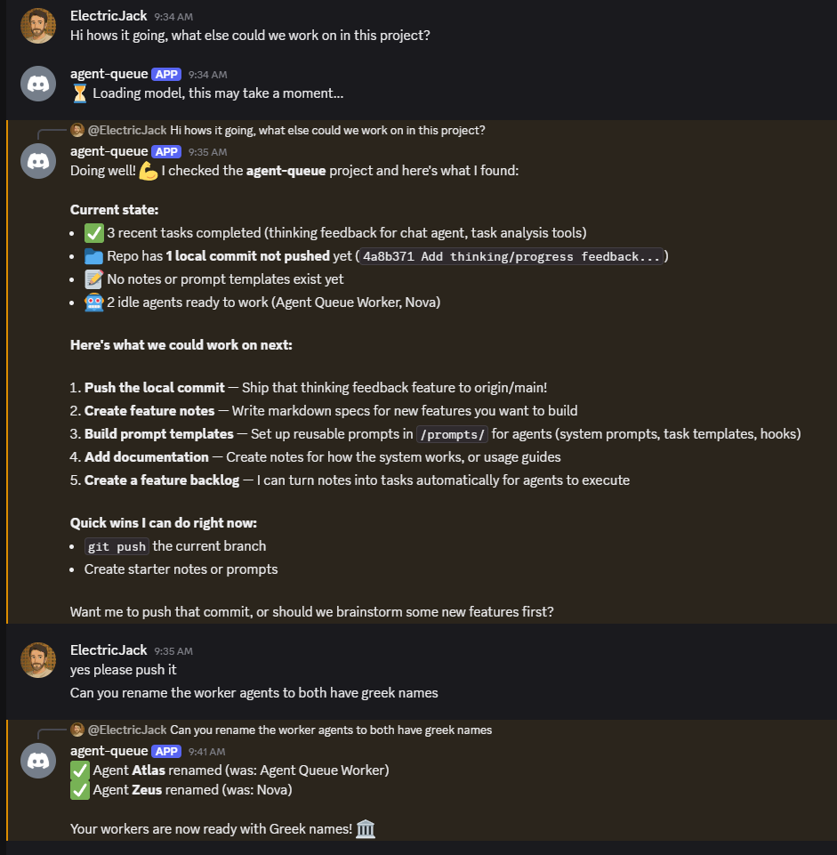
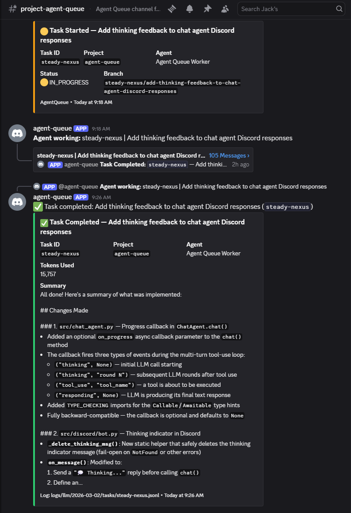

# Agent Queue

**A self-improving orchestration platform for AI coding agents.**

Agent Queue manages task queues across multiple projects, coordinates multi-agent workflows through executable playbooks, accumulates knowledge via a 4-tier memory architecture, and continuously improves through automated reflection. Every completed task feeds insights back into the system — the longer it runs, the better it gets.

Manage everything from Discord, your terminal, or any MCP-compatible client. Queue up a week's worth of tasks, come back to completed PRs and a system that knows more about your codebase than it did yesterday.

<table>
<tr>
<td></td>
<td></td>
</tr>
</table>

## Key Capabilities

### Self-Improvement Loop
The core value proposition: **the system gets better with use.**
- **Reflection engine.** Post-task review extracts generalizable insights — what worked, what failed, what to remember. Configurable depth tiers (deep/standard/light) with circuit breaker protection.
- **Continuous learning.** Every task leaves the system better prepared for the next one. Error patterns, successful strategies, and project conventions accumulate in scoped memory.
- **Knowledge consolidation.** Periodic consolidation distills raw task memories into structured knowledge bases, project factsheets, and agent-type wisdom.
- **Autonomous operation.** The improvement loop requires no manual intervention — reflection playbooks run automatically, write insights, and feed them to future agents.

### Orchestration & Scheduling
- **Multi-agent, multi-project.** Run parallel Claude Code agents across all your projects, each in isolated workspaces with your existing environment.
- **Proportional scheduling.** Deficit-based fair-share algorithm distributes agent time across projects — the most under-served project gets the next agent slot. Zero LLM calls for orchestration.
- **Smart cascade.** Each 5-second orchestration cycle runs a deterministic promotion cascade: check approvals, resume paused tasks, promote dependency-satisfied tasks, and monitor for stuck work.
- **Rate limit recovery.** Auto-pause on throttle, auto-resume when the window resets. While one agent is paused, others keep working.
- **Full task lifecycle.** DEFINED → READY → ASSIGNED → IN_PROGRESS → COMPLETED, with retry, escalation, dependency management, and plan-based subtask generation.

### Playbooks — Workflow Automation
- **DAG-based workflows.** Author multi-step automation as markdown files; an LLM compiles them into executable directed graphs with conditional branching and context accumulation.
- **Human-in-the-loop.** Pause playbook execution at checkpoints for human review before proceeding. Resume with input that flows into the conversation context.
- **Event-driven composition.** Playbooks trigger on system events (`task.completed`, `git.push`, `timer.24h`) and chain together via event-driven composition.
- **Scoped automation.** System-wide, project-specific, or agent-type playbooks — each runs only where it applies. Replaces the older single-shot hook/rule systems with multi-step reasoning.

### Agent Coordination
- **Playbook-driven workflows.** Coordination playbooks define multi-agent pipelines — feature development, review cycles, parallel exploration — as readable markdown.
- **Agent affinity.** Prefer agents with context continuity from earlier workflow stages. Advisory with bounded wait — falls back gracefully when the preferred agent is busy.
- **Workspace strategies.** Exclusive locks for safety, branch-isolated for parallel work on the same repo, directory-isolated for monorepos.
- **Temporary constraints.** Exclusive project access for migrations, per-type concurrency limits, release-on-completion semantics.

### Memory & Knowledge Management
- **4-tier memory architecture.** L0 Identity, L1 Critical Facts, L2 Topic Context, L3 Deep Search — each tier loaded at the right time to minimize token usage and maximize relevance.
- **Semantic search + KV store + temporal facts.** Milvus-backed unified storage with vector search, exact key-value lookups, and time-windowed facts with full history.
- **Scoped knowledge.** System → Agent-Type → Project hierarchy. Knowledge flows from broad to specific, with overrides at each level.
- **Automatic deduplication & merging.** New memories are compared against existing ones; near-duplicates are merged via LLM to prevent knowledge sprawl.

### Plugin System
- **Extensible architecture.** 5 internal plugins ship by default (files, git, memory, notes, vibecop). Install third-party plugins from git repos.
- **Full integration.** Plugins register tools, subscribe to events, add CLI and Discord commands, and run cron-scheduled functions.
- **Circuit breaker protection.** Failing plugins are auto-disabled to prevent cascading failures.

### Developer Experience
- **Discord + CLI + MCP.** Manage from your phone via Discord, your terminal via the CLI, or any MCP client via the auto-exposed tool server (~150 tools).
- **Vault & Obsidian integration.** All knowledge, playbooks, and profiles stored as markdown in `~/.agent-queue/vault/` — browse and edit with Obsidian or any text editor.
- **Agent profiles.** Configure agent behavior, tools, and MCP servers via markdown profiles. Assign profiles per-project or per-task.
- **Live streaming.** Each task gets a Discord thread. Watch agents work in real time. Reply to unblock them.
- **Multi-provider LLM support.** Anthropic direct, AWS Bedrock, Google Vertex AI, Gemini, or Ollama for LLM calls.

## Getting Started

**Prerequisites:** Python 3.12+, a [Discord bot token](https://discord.com/developers/applications), Claude Code installed.

```bash
git clone https://github.com/ElectricJack/agent-queue.git
cd agent-queue
./setup.sh
```

The setup script handles dependencies, Discord config, API keys, and first agent creation.

Once running, talk to the bot in your Discord channel:

```
You:  link ~/code/my-app as my-app
You:  create a project called my-app
You:  create agent claude-1 and assign it to my-app
You:  add a task to add rate limiting to the API
```

Or use the CLI:

```bash
aq status                              # system overview
aq task add "Add rate limiting" -p my-app  # create a task
aq task list                           # see all tasks
```

Or connect via MCP from Claude Code, Cursor, or any MCP-compatible client.

## Architecture at a Glance

```
asyncio event loop
├── Discord Bot / MCP Server     — control planes (human + machine)
├── Supervisor                   — LLM-powered conversation, tool dispatch, reflection
│   ├── PromptBuilder            — 5-layer context assembly (L0-L3 + tools)
│   ├── ReflectionEngine         — post-action review with depth tiers
│   └── ToolRegistry             — tiered tool loading (core + on-demand)
├── Orchestrator                 — deterministic task lifecycle (zero LLM calls)
│   ├── Scheduler                — proportional deficit-based assignment
│   ├── State Machine            — formal task state transitions + DAG validation
│   ├── Smart Cascade            — promotion pipeline each cycle
│   ├── Plan Parser              — discovers plans, creates subtask chains
│   └── Playbook Engine          — event-triggered DAG workflows
│       ├── PlaybookCompiler     — markdown → JSON graph (LLM-powered, one-shot)
│       ├── PlaybookRunner       — graph walker with conversation history
│       └── PlaybookManager      — lifecycle, triggers, cooldown, concurrency
├── Workflow Coordination        — multi-agent pipeline orchestration
│   ├── Stage Resume Handler     — auto-resume on stage completion events
│   ├── Orphan Recovery          — detect & recover stale/crashed workflows
│   └── Pipeline View            — dashboard-ready visualization
├── Plugin Registry              — modular tool/event/cron extensibility
├── Memory V2 Service            — Milvus-backed 4-tier knowledge
│   ├── Semantic search          — multi-scope weighted vector search
│   ├── KV store                 — fast scalar lookups per scope
│   ├── Temporal facts           — validity-windowed facts with history
│   └── Memory Extractor         — auto-extracts knowledge from events
├── EventBus                     — async pub/sub with wildcard + payload filtering
└── Adapters                     — agent backends (Claude Code, extensible)
```

**Design philosophy:** Zero LLM calls for orchestration. Structure guides intelligence. Files are the source of truth. The system improves with use. See the [design principles](docs/specs/design/guiding-design-principles.md) for the full philosophy.

## How the Self-Improvement Loop Works

```
Task Execution
  └── Agent saves insights during work (memory_save, memory_fact_store)
        │
        ▼
Task Completion
  └── Reflection engine reviews the task (deep/standard/light)
        │
        ▼
Knowledge Extraction
  └── Patterns, errors, strategies distilled into scoped memory
        │
        ▼
Memory Consolidation
  └── Periodic playbooks organize, deduplicate, and merge insights
        │
        ▼
Next Task
  └── Future agents receive accumulated knowledge via prompt builder
        └── Better performance, fewer mistakes, learned conventions
              │
              ▼
           (cycle continues — system gets better)
```

## Development

```bash
pip install -e ".[dev,cli]"
pip install -e packages/aq-client      # typed API client (generated)
pre-commit install                     # ruff formatting on every commit
pytest tests/                          # run test suite
./run.sh start                         # start the daemon
```

## Documentation

- **[Full docs](https://electricjack.github.io/agent-queue/)** — architecture, commands, playbooks, adapters
- **[Design specs](docs/specs/design/)** — guiding principles, playbooks, memory, self-improvement, coordination
- **[profile.md](profile.md)** — project architecture, conventions, codebase map

## License

MIT
