# Agent-Queue Primitives — Complete Breakdown

A map of every first-class primitive in agent-queue, organized by *what role it plays* and *what it exposes to what*. Relationships come first — the primitives themselves are anchors for the flows between them.

---

## 0. The One Mermaid

```mermaid
graph TB
    %% ===== CONFIG / IDENTITY =====
    subgraph Config["Config &amp; Identity — Vault (markdown) + DB (synced)"]
        direction TB
        Project[("Project<br/><i>projects</i>")]
        Repo[("Repo<br/><i>repos</i>")]
        Profile[("AgentProfile<br/><i>agent_profiles + vault/agent-types/&lt;type&gt;/profile.md</i><br/>role · model · allowed_tools · mcp_servers")]
        Override["Project Override<br/><i>vault/projects/&lt;id&gt;/overrides/&lt;type&gt;.md</i>"]
        FactSheet["Project Factsheet<br/><i>vault/projects/&lt;id&gt;/memory/factsheet.md</i>"]
    end

    %% ===== PROCESS KNOWLEDGE =====
    subgraph Process["Process Knowledge — Vault"]
        direction TB
        PBMd[["Playbook .md<br/><i>vault/**/playbooks/*.md</i>"]]
        PBJson[["Compiled Playbook .json<br/><i>~/.agent-queue/compiled/</i>"]]
        PBMd -. LLM compile .-> PBJson
    end

    %% ===== MEMORY =====
    subgraph Memory["Memory — 4 tiers, 4 scopes"]
        direction TB
        L0["L0 Identity<br/>(from Profile)"]
        L1["L1 Facts KV<br/><i>vault/**/memory/facts.md</i>"]
        L2["L2 Topic<br/><i>vault/**/memory/knowledge/*.md</i>"]
        L3["L3 Search<br/>(memory_search tool)"]
        Milvus[("Milvus<br/>aq_system / aq_agenttype_&lt;t&gt; / aq_project_&lt;id&gt;")]
        L1 --> Milvus
        L2 --> Milvus
        L3 --> Milvus
    end

    %% ===== TOOLS PLANE =====
    subgraph Tools["Tools Plane"]
        direction TB
        Plugin[("Plugin<br/><i>plugins table + src/plugins/</i>")]
        ToolReg["Tool Registry"]
        Cmd["CommandHandler<br/>~150 commands"]
        MCP["MCP Servers"]
        Plugin -- registers --> ToolReg
        ToolReg --> Cmd
        Plugin -- may expose --> MCP
    end

    %% ===== EXECUTION STATE =====
    subgraph Exec["Execution State — DB"]
        direction TB
        Task[("Task<br/><i>tasks</i><br/>+ criteria/context/metadata/deps/result")]
        Workflow[("Workflow<br/><i>workflows</i> — multi-agent coord")]
        PBRun[("PlaybookRun<br/><i>playbook_runs</i>")]
        Workspace[("Workspace<br/><i>workspaces</i><br/>lock = agent identity")]
        Tokens[("Token Ledger")]
        Events[("Events")]
    end

    %% ===== RUNTIME =====
    subgraph Runtime["Runtime Components"]
        direction TB
        Orch["Orchestrator<br/>5s cycle"]
        Sched["Scheduler<br/>deficit/fair"]
        PBRunner["PlaybookRunner"]
        Super["Supervisor"]
        Prompt["PromptBuilder<br/>5-layer"]
        EBus["EventBus"]
        FW["FileWatcher"]
    end

    %% ===== EDGES =====
    Project -- owns --> Repo
    Project -- default_profile_id --> Profile
    Project -- scopes --> Override
    Project -- has --> FactSheet

    Task -- project_id --> Project
    Task -- profile_id --> Profile
    Task -- preferred_workspace_id --> Workspace
    Task -- workflow_id --> Workflow
    Workflow -- playbook_run_id --> PBRun
    PBRun -- executes --> PBJson

    Profile -- exposes to Task --> ToolReg
    Profile -- exposes to Task --> MCP
    Profile -- supplies --> L0

    Orch -- assigns --> Task
    Orch -- via --> Sched
    Orch -- locks --> Workspace
    Orch -- builds ctx via --> Prompt
    Orch -- emits --> EBus

    Prompt -- reads --> L0
    Prompt -- reads --> L1
    Prompt -- reads --> L2
    Prompt -- reads --> FactSheet
    Prompt -- reads --> Override
    Prompt -- binds --> ToolReg

    EBus -- persists --> Events
    EBus -- triggers --> PBRunner
    PBRunner -- creates --> PBRun
    PBRunner -- may create --> Task
    PBRunner -- may create --> Workflow

    FW -- compiles --> PBJson
    FW -- syncs --> Profile
    FW -- reindexes --> Milvus

    Super -- invokes --> Cmd
    Cmd -- mutates --> Task
    Cmd -- mutates --> Project
    Cmd -- mutates --> Workflow

    classDef db fill:#1e3a5f,stroke:#4a90e2,color:#fff
    classDef file fill:#4a2d5f,stroke:#a569bd,color:#fff
    classDef run fill:#5f4a1e,stroke:#e2a64a,color:#fff
    classDef mem fill:#1e5f3a,stroke:#4ae290,color:#fff
    classDef tool fill:#5f1e3a,stroke:#e24a90,color:#fff

    class Project,Repo,Profile,Task,Workflow,PBRun,Workspace,Tokens,Events,Plugin db
    class PBMd,PBJson,Override,FactSheet file
    class Orch,Sched,PBRunner,Super,Prompt,EBus,FW run
    class L0,L1,L2,L3,Milvus mem
    class ToolReg,Cmd,MCP tool
```



---

## 1. The Core Narrative (who does what)

> An **Agent** is not a row — it is the lock state of a **Workspace**. When a Workspace is locked by a Task, the (Profile + Workspace + Task) triple *is* the running agent.

**Agents run Playbooks.** A Playbook is a markdown-authored LLM decision graph. The FileWatcher compiles it to JSON; the EventBus triggers it; the PlaybookRunner executes it; a PlaybookRun row records the execution. Playbooks can create Tasks and Workflows.

**Profiles expose tools to Agents.** An AgentProfile (sourced from `vault/agent-types/<type>/profile.md`, synced to `agent_profiles` DB) carries `allowed_tools` (whitelist into the Tool Registry) and `mcp_servers` (dict of MCP server configs). At task-start, the PromptBuilder binds the profile's tool set into the agent's TaskContext. Plugins *register* tools into the registry; profiles *select* from the registry.

**Memory is scoped, tiered, and weighted.** Four scopes (system / agent-type / project / project-override), four tiers (L0 identity → L1 facts → L2 topic → L3 search). L0/L1 are always injected into the prompt; L2 is topic-filtered at context build time; L3 is a tool the agent calls mid-run. Vault markdown is the source; Milvus is the index.

**Everything flows through CommandHandler.** Discord, MCP, CLI, and playbook tool-calls all hit the same ~150 commands. That's the system's one mutation boundary.

---

## 2. Primitives by Category

### A. Persisted (SQLAlchemy — `src/database/tables.py`)

| Primitive | Table | Role |
|---|---|---|
| **Project** | `projects` | Scheduling unit. Owns credit weight, concurrency cap, budget, default profile, Discord channels. |
| **Task** | `tasks` (+ `task_criteria`, `task_context`, `task_metadata`, `task_tools`, `task_dependencies`, `task_results`) | Unit of work. State machine DEFINED → READY → ASSIGNED → IN_PROGRESS → COMPLETED/FAILED/BLOCKED. |
| **Workspace** | `workspaces` | Filesystem execution context. Its lock (`locked_by_agent_id`, `locked_by_task_id`, `lock_mode`) *is* the agent. |
| **Repo** | `repos` | Git config (url, default branch, source_type: CLONE/LINK/INIT/WORKTREE). |
| **AgentProfile** | `agent_profiles` | Capability bundle. `allowed_tools` + `mcp_servers` + `system_prompt_suffix` + model override. Mirror of vault markdown. |
| **Workflow** | `workflows` | Multi-agent coordination instance. Stage gates, agent affinity, workspace strategy. Spawned by a coordination playbook. |
| **PlaybookRun** | `playbook_runs` | One execution of a compiled playbook — conversation history, node trace, pause state. |
| **Agent** | `agents` | *Legacy.* Being replaced by Workspace-as-agent model. |
| **Token Ledger** | `token_ledger` | Append-only token usage per (project, agent, task). |
| **Events** | `events` | Append-only event log (EventBus persistence). |
| **Rate Limits** | `rate_limits` | Sliding-window limits per agent type. |
| **Project Constraints** | `project_constraints` | Temporary scheduling clamps (pause, exclusive, type caps). |
| **Plugins / Plugin Data** | `plugins`, `plugin_data` | Installed plugin registry + per-instance KV. |
| **Archived Tasks** | `archived_tasks` | Completed/failed task snapshots for audit + memory consolidation. |
| **Chat Suggestions** | `chat_analyzer_suggestions` | LLM-surfaced suggestions from Discord chat. |
| **System Config** | `system_config` | Runtime-tunable KV (separate from `config.yaml`). |

### B. Filesystem (Vault — `~/.agent-queue/vault/`)

Vault is Obsidian-compatible markdown. Scoped by directory: `system/` · `orchestrator/` · `agent-types/<type>/` · `projects/<id>/`.

| Primitive | Path | Role |
|---|---|---|
| **Playbook (source)** | `vault/**/playbooks/*.md` | YAML frontmatter (id, triggers, scope, cooldown) + English body. Source of truth. |
| **Compiled Playbook** | `~/.agent-queue/compiled/<id>.compiled.json` | LLM-generated DAG (nodes, transitions, terminals, pause points). Versioned via source_hash. |
| **Agent Profile (source)** | `vault/agent-types/<type>/profile.md` | `## Role` (English) · `## Config` (JSON) · `## Tools` (JSON) · `## MCP Servers` (JSON) · `## Rules` · `## Reflection`. Synced to DB on change. |
| **Project Factsheet** | `vault/projects/<id>/memory/factsheet.md` | YAML: urls, tech_stack, contacts, key_paths, environments. Quick-reference card. |
| **Project Override** | `vault/projects/<id>/overrides/<type>.md` | Project-specific tweaks to an agent-type profile. Supplements, doesn't replace. |
| **Memory (knowledge)** | `vault/**/memory/knowledge/*.md`, `memory/insights/*.md` | Semantically-indexed markdown with `topic:` frontmatter. |
| **Facts KV** | `vault/**/memory/facts.md` | JSON blocks of deterministic facts (test_command, deploy_branch, etc). L1 tier — always loaded. |
| **Project Notes** | `vault/projects/<id>/notes/*.md`, `README.md` | Human-authored context. |
| **Reference Stubs** | `vault/projects/<id>/references/spec-*.md` | Auto-generated summaries of repo specs, pinned to `source_hash`. |

### C. Runtime / Transient

| Primitive | Where | Role |
|---|---|---|
| **Orchestrator** | `src/orchestrator/` | 5s cycle. Runs Smart Cascade: approvals → resume paused → promote DEFINED → stuck monitoring. Deterministic, no LLM in cycle. |
| **Scheduler** | `src/scheduler.py` | Deficit-based fair scheduling. Honors deps, project concurrency, constraints. |
| **PlaybookRunner** | `src/playbooks/runner.py` (+ `runner_transitions.py`, `runner_events.py`, `runner_context.py`, `resume_handler.py`) | Walks compiled graph, invokes LLM per node, evaluates transitions, pauses for human input. |
| **PlaybookCompiler** | `src/playbooks/compiler.py` | MD → LLM → JSON schema validation → `compiled/<id>.json`. |
| **PlaybookManager** | `src/playbooks/manager.py` | Lifecycle API (list/get/compile/run/inspect). |
| **Supervisor** | `src/supervisor.py` | LLM agent for user chat, task CRUD, diagnostics. Uses CommandHandler + Reflection. |
| **Reflection Engine** | `src/reflection.py` | Post-action verdict pass. Tiers: deep (task.completed) / standard (user.request) / light (periodic). Circuit-breakered. |
| **PromptBuilder** | `src/prompt_builder.py` | 5-layer: L0 role → override → L1 facts → L2 context → identity → tools. Budget-aware. |
| **EventBus** | `src/event_bus.py` (+ schemas in `src/event_schemas.py`) | Typed pub-sub. Triggers playbooks, notifies adapters, drives orchestration. |
| **FileWatcher** | `src/file_watcher.py`, `src/workspace_spec_watcher.py` | Vault + workspace spec changes → compile / sync / reindex. |
| **CommandHandler** | `src/commands/handler.py` (+ mixins in `src/commands/`) | Single mutation entry point. Auto-exposed as MCP tools. |
| **Tool Registry** | `src/tools/registry.py` | Plugins register here; profiles select from here. |
| **Messaging Adapters** | `src/discord/`, `src/telegram/`, `src/messaging/base.py` | Platform-agnostic send/receive + notification routing. |
| **Chat Providers** | `src/chat_providers/` | Normalized LLM client (Anthropic / OpenAI / Ollama / Gemini) returning `ChatResponse`. |
| **Memory V2 Plugin** | `src/plugins/internal/memory_v2/` + `packages/memsearch/` | Milvus-backed. Semantic + KV + temporal facts. Multi-scope weighted queries. |

### D. Enums / Shape Primitives (`src/models.py`)

| Primitive | Values | Role |
|---|---|---|
| **TaskStatus** | DEFINED, READY, ASSIGNED, IN_PROGRESS, WAITING_INPUT, PAUSED, AWAITING_APPROVAL, COMPLETED, FAILED, BLOCKED | Task state machine. |
| **TaskEvent** | DEPS_MET, AGENT_STARTED, AGENT_COMPLETED, TOKENS_EXHAUSTED, ... | Valid state transitions. |
| **TaskType** | FEATURE, BUGFIX, REFACTOR, TEST, DOCS, CHORE, RESEARCH, PLAN, SYNC | Categorization (UI + agent hints). |
| **VerificationType** | AUTO_TEST, QA_AGENT, HUMAN | Completion-pipeline verify phase. |
| **WorkspaceMode** | EXCLUSIVE, BRANCH_ISOLATED, DIRECTORY_ISOLATED | Lock semantics. |
| **RepoSourceType** | CLONE, LINK, INIT, WORKTREE | Workspace init strategy. |
| **AgentResult** | COMPLETED, FAILED, PAUSED_TOKENS, PAUSED_RATE_LIMIT, WAITING_INPUT | Agent adapter outcome. |
| **ProjectStatus** | ACTIVE, PAUSED, ARCHIVED | Scheduling gate. |
| **PlaybookRunStatus** | RUNNING, PAUSED, COMPLETED, FAILED, TIMED_OUT | Playbook run lifecycle. |
| **PlaybookScope** | system, project, agent-type:<t> | Trigger scope. |

### E. Context Bundles (data classes — prompt and agent I/O)

| Primitive | Where | Role |
|---|---|---|
| **TaskContext** | `src/models.py` | Bundle passed to agent adapter: description, L0 role, L1 facts, L2 context, criteria, test_commands, checkout_path, branch_name, attached_context, image_paths, **mcp_servers**, add_dirs, resume_session_id. |
| **MemoryContext** | `src/models.py` | Assembled L0+L1+L2+L3 trimmed to budget. `to_context_block()` → markdown. |
| **AgentOutput** | `src/models.py` | What an adapter returns: result, summary, files_changed, tokens_used, error, session_id. |
| **CompiledPlaybook** | `src/playbooks/models.py` | Nodes, transitions, `llm_config`, `pause_timeout`, `max_tokens`. |
| **ChatResponse** | `src/chat_providers/types.py` | Unified LLM response: text, tool_use, stop_reason, usage. |

---

## 3. Who Exposes What To Whom

This is the part that usually trips people up. Each arrow is "X makes Y visible to Z."

| What gets exposed | Exposed by | Exposed to | Mechanism |
|---|---|---|---|
| **Tools** | Plugin | Tool Registry | Plugin's `register()` call |
| **Tools** (allowlist) | AgentProfile | a specific Agent/Task | `profile.allowed_tools` → filtered at PromptBuilder |
| **MCP servers** | AgentProfile | a specific Agent/Task | `profile.mcp_servers` → passed through TaskContext to the adapter |
| **MCP tools** (all ~150 CommandHandler commands) | CommandHandler | external IDEs / Claude Code | Embedded MCP server auto-exposes every command |
| **Identity/role** | AgentProfile `## Role` | the running agent | L0 tier in PromptBuilder |
| **Facts** | `vault/**/memory/facts.md` | the running agent | L1 tier — always in prompt |
| **Topic knowledge** | `vault/**/memory/knowledge/*.md` | the running agent | L2 tier — topic-filtered, injected at task start |
| **Deep search** | Milvus collections | the running agent | L3 tier — `memory_search` tool call mid-run |
| **Project overrides** | `vault/projects/<id>/overrides/<type>.md` | the running agent | Layered on top of base profile in PromptBuilder |
| **Events** | every subsystem | Playbooks + Notifications | EventBus pub-sub |
| **Playbook triggers** | CompiledPlaybook.triggers | EventBus | Runner subscribes on load |
| **Tasks** to Workflow | PlaybookRunner (coord playbook) | Workflow | `create_task` tool inside the playbook |
| **Scheduling slot** | Project (via credit_weight + concurrency) | Scheduler | Deficit accounting |

---

## 4. Scope System (4 levels, resolved by cascade)

```
system                     ← broadest, aq_system Milvus collection
  └─ agent-type:<type>     ← applies across all projects, per type
       └─ project:<id>     ← per-project
            └─ project-override (agent-type × project)  ← most specific
```

- **Memory:** all 4 queried in parallel; results *weighted by specificity*.
- **Profiles:** base `agent-type` profile + optional `project override` layer.
- **Playbooks:** triggers fire at their own scope level only.

---

## 5. Key Lifecycles

**Task:** CLI/API/playbook creates (DEFINED) → deps met (READY) → scheduler picks agent+workspace (ASSIGNED) → adapter runs (IN_PROGRESS, may PAUSE / WAIT_INPUT / AWAIT_APPROVAL) → completion pipeline: verify → git ops → plan gen → notify → COMPLETED/FAILED → archived.

**Playbook:** human edits markdown → FileWatcher detects → Compiler (LLM + schema) writes JSON → Manager loads → EventBus triggers → PlaybookRun spawned → Runner walks graph → pause/resume on human input → terminal node → record persists for replay.

**Profile:** human edits `vault/agent-types/<type>/profile.md` → FileWatcher detects → parser extracts JSON blocks + sections → `agent_profiles` row upserted → next TaskContext pulls new values.

**Memory:** human writes markdown → FileWatcher detects → memory plugin parses + embeds + indexes into the correct-scope Milvus collection → agents retrieve via L0/L1 injection or L2/L3 queries.

---

## 6. Files You'd Touch To Change Behavior

| Want to change... | Edit... |
|---|---|
| Task state transitions | `src/models.py` (TaskStatus/TaskEvent) + `src/state_machine.py` |
| What schema looks like | `src/database/tables.py` + `alembic revision --autogenerate` |
| How prompts are built | `src/prompt_builder.py` + templates in `src/prompts/` |
| How scheduler picks work | `src/scheduler.py` |
| How playbooks compile | `src/playbooks/compiler.py` + `src/playbook_schema.json` |
| How events flow | `src/event_bus.py` + `src/event_schemas.py` |
| A specific playbook | `vault/**/playbooks/*.md` |
| An agent's capabilities | `vault/agent-types/<type>/profile.md` |
| Facts the agent always sees | `vault/**/memory/facts.md` |
| Indexed knowledge | `vault/**/memory/knowledge/*.md` |
| What commands exist | `src/commands/*.py` |
| A plugin's tools | `src/plugins/internal/<name>/` or external plugin repo |
