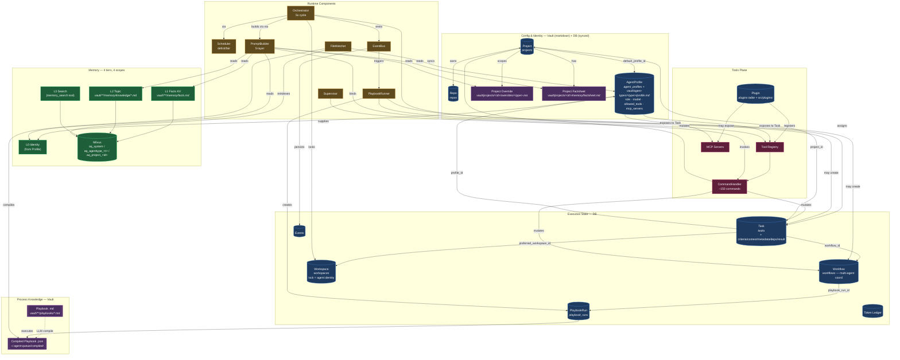

```mermaid
graph TB
    %% ===== CONFIG / IDENTITY =====
    subgraph Config["Config &amp; Identity — Vault (markdown) + DB (synced)"]
        direction TB
        Project[("Project<br/><i>projects</i>")]
        Repo[("Repo<br/><i>repos</i>")]
        Profile[("AgentProfile<br/><i>agent_profiles + vault/agent-types/&lt;type&gt;/profile.md</i><br/>role · model · allowed_tools · mcp_servers")]
        Override["Project Override<br/><i>vault/projects/&lt;id&gt;/overrides/&lt;type&gt;.md</i>"]
        FactSheet["Project Factsheet<br/><i>vault/projects/&lt;id&gt;/memory/factsheet.md</i>"]
    end

    %% ===== PROCESS KNOWLEDGE =====
    subgraph Process["Process Knowledge — Vault"]
        direction TB
        PBMd[["Playbook .md<br/><i>vault/**/playbooks/*.md</i>"]]
        PBJson[["Compiled Playbook .json<br/><i>~/.agent-queue/compiled/</i>"]]
        PBMd -. LLM compile .-> PBJson
    end

    %% ===== MEMORY =====
    subgraph Memory["Memory — 4 tiers, 4 scopes"]
        direction TB
        L0["L0 Identity<br/>(from Profile)"]
        L1["L1 Facts KV<br/><i>vault/**/memory/facts.md</i>"]
        L2["L2 Topic<br/><i>vault/**/memory/knowledge/*.md</i>"]
        L3["L3 Search<br/>(memory_search tool)"]
        Milvus[("Milvus<br/>aq_system / aq_agenttype_&lt;t&gt; / aq_project_&lt;id&gt;")]
        L1 --> Milvus
        L2 --> Milvus
        L3 --> Milvus
    end

    %% ===== TOOLS PLANE =====
    subgraph Tools["Tools Plane"]
        direction TB
        Plugin[("Plugin<br/><i>plugins table + src/plugins/</i>")]
        ToolReg["Tool Registry"]
        Cmd["CommandHandler<br/>~150 commands"]
        MCP["MCP Servers"]
        Plugin -- registers --> ToolReg
        ToolReg --> Cmd
        Plugin -- may expose --> MCP
    end

    %% ===== EXECUTION STATE =====
    subgraph Exec["Execution State — DB"]
        direction TB
        Task[("Task<br/><i>tasks</i><br/>+ criteria/context/metadata/deps/result")]
        Workflow[("Workflow<br/><i>workflows</i> — multi-agent coord")]
        PBRun[("PlaybookRun<br/><i>playbook_runs</i>")]
        Workspace[("Workspace<br/><i>workspaces</i><br/>lock = agent identity")]
        Tokens[("Token Ledger")]
        Events[("Events")]
    end

    %% ===== RUNTIME =====
    subgraph Runtime["Runtime Components"]
        direction TB
        Orch["Orchestrator<br/>5s cycle"]
        Sched["Scheduler<br/>deficit/fair"]
        PBRunner["PlaybookRunner"]
        Super["Supervisor"]
        Prompt["PromptBuilder<br/>5-layer"]
        EBus["EventBus"]
        FW["FileWatcher"]
    end

    %% ===== EDGES =====
    Project -- owns --> Repo
    Project -- default_profile_id --> Profile
    Project -- scopes --> Override
    Project -- has --> FactSheet

    Task -- project_id --> Project
    Task -- profile_id --> Profile
    Task -- preferred_workspace_id --> Workspace
    Task -- workflow_id --> Workflow
    Workflow -- playbook_run_id --> PBRun
    PBRun -- executes --> PBJson

    Profile -- exposes to Task --> ToolReg
    Profile -- exposes to Task --> MCP
    Profile -- supplies --> L0

    Orch -- assigns --> Task
    Orch -- via --> Sched
    Orch -- locks --> Workspace
    Orch -- builds ctx via --> Prompt
    Orch -- emits --> EBus

    Prompt -- reads --> L0
    Prompt -- reads --> L1
    Prompt -- reads --> L2
    Prompt -- reads --> FactSheet
    Prompt -- reads --> Override
    Prompt -- binds --> ToolReg

    EBus -- persists --> Events
    EBus -- triggers --> PBRunner
    PBRunner -- creates --> PBRun
    PBRunner -- may create --> Task
    PBRunner -- may create --> Workflow

    FW -- compiles --> PBJson
    FW -- syncs --> Profile
    FW -- reindexes --> Milvus

    Super -- invokes --> Cmd
    Cmd -- mutates --> Task
    Cmd -- mutates --> Project
    Cmd -- mutates --> Workflow

    classDef db fill:#1e3a5f,stroke:#4a90e2,color:#fff
    classDef file fill:#4a2d5f,stroke:#a569bd,color:#fff
    classDef run fill:#5f4a1e,stroke:#e2a64a,color:#fff
    classDef mem fill:#1e5f3a,stroke:#4ae290,color:#fff
    classDef tool fill:#5f1e3a,stroke:#e24a90,color:#fff

    class Project,Repo,Profile,Task,Workflow,PBRun,Workspace,Tokens,Events,Plugin db
    class PBMd,PBJson,Override,FactSheet file
    class Orch,Sched,PBRunner,Super,Prompt,EBus,FW run
    class L0,L1,L2,L3,Milvus mem
    class ToolReg,Cmd,MCP tool
```
