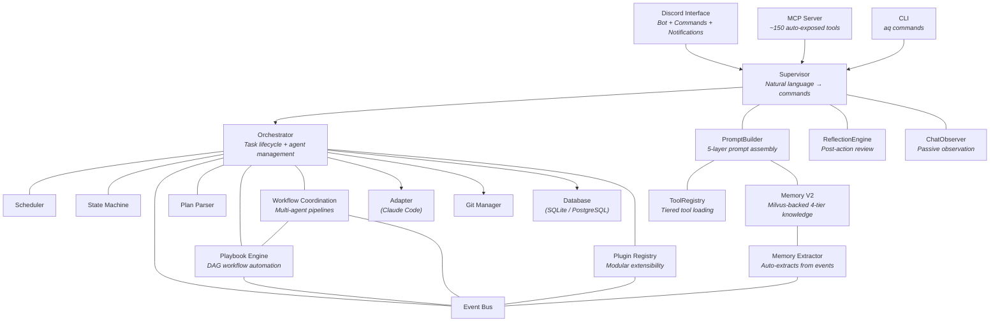

# Architecture

## Overview

Agent Queue is a single-process Python daemon that orchestrates AI coding agents, automates workflows via playbooks, coordinates multi-agent pipelines, and continuously improves through a 4-tier memory system and reflection engine. The system is designed around two core principles: **zero LLM overhead for orchestration** (every token goes to agent work) and **self-improvement with use** (every task leaves the system smarter).

## System Components



## Key Design Decisions

> See [[specs/design/guiding-design-principles|Guiding Design Principles]] for the full 10-principle design philosophy.

### Zero LLM Overhead for Orchestration

The [[specs/scheduler-and-budget|scheduler]] and task routing use no LLM calls. Every token the system spends is a token an agent spends on actual work. Scheduling decisions are deterministic via a deficit-based proportional credit-weight algorithm — the most under-served project gets the next agent slot.

Each 5-second orchestration cycle runs a deterministic cascade: check approvals, resume paused tasks, promote dependency-satisfied tasks, assign ready work to available agents, and monitor for stuck work. No LLM reasoning needed.

### Self-Improvement Loop

Every completed task feeds the [[specs/reflection|reflection engine]], which extracts generalizable insights. The [[specs/design/memory-plugin|memory system]] preserves them across scopes. [[specs/design/playbooks|Playbooks]] automate the consolidation cycle. Future agents receive these insights via the prompt builder's 4-tier context assembly. See [[specs/design/self-improvement|Self-Improvement]] for the full loop.

```
Task Execution → Reflection → Knowledge Extraction → Memory Consolidation → Next Task
     ↑                                                                          │
     └──────────────────── system gets better ─────────────────────────────────┘
```

### Playbooks Replace Hooks and Rules

The old hook/rule system provided single-shot LLM automation. [[specs/design/playbooks|Playbooks]] replace this with multi-step directed graphs: each node is a focused LLM decision point, transitions carry context forward, and human checkpoints enable oversight. Authored as markdown, compiled to JSON by an LLM, executed as graph walks with conversation history across nodes.

Built-in playbooks include:
- **task-outcome** — post-task reflection and insight extraction
- **feature-pipeline** — code → review → QA with affinity and feedback loops
- **bugfix-pipeline** — code → QA (streamlined)
- **review-cycle** — PR review with iterative feedback
- **parallel-exploration** — multiple agents investigate different approaches

### Agent Coordination

[[specs/design/agent-coordination|Coordination playbooks]] define multi-agent workflows as readable markdown. The scheduler infers parallelism from dependency graphs — playbooks say "B depends on A," the scheduler runs B and C concurrently when A completes.

Key coordination capabilities:
- **Agent affinity** — prefer agents with context continuity from earlier stages
- **Workspace lock modes** — exclusive (default), branch-isolated, directory-isolated
- **Temporary constraints** — exclusive project access for migrations, per-type concurrency limits
- **Coordinator-scheduler separation** — playbooks own workflow structure, scheduler owns concurrency decisions

### Files as Source of Truth

Playbooks, profiles, facts, and knowledge live as markdown files in `~/.agent-queue/vault/`. This makes everything browsable in Obsidian, editable by hand, and diffable with git. The database and Milvus are derived indexes, not canonical stores. A unified file watcher detects changes and applies them automatically.

### 4-Tier Memory Architecture

Not all knowledge is needed at all times. The memory system loads the right knowledge at the right time:

| Tier | Name | Budget | When Loaded | Contains |
|------|------|--------|-------------|----------|
| L0 | Identity | ~50 tokens | Always | Agent type profile `## Role` section |
| L1 | Critical Facts | ~200 tokens | Task start | Project + agent-type `facts.md` KV entries |
| L2 | Topic Context | ~500 tokens | On-demand | Memories matching task topic (pre-filtered) |
| L3 | Deep Search | Variable | Explicit query | Full semantic search across all scopes |

Knowledge is scoped from broad to specific: System → Agent-Type → Project. When the same question has answers at different levels, the most specific scope wins.

### Event-Driven Architecture

All subsystems communicate through an async EventBus with wildcard and payload filtering support. Events drive playbook triggers, memory extraction, plugin notifications, and cross-component coordination. New capabilities subscribe to existing events without modifying existing code.

### Spec-Driven Development

Each module has a corresponding specification in the `specs/` directory. These specs serve as the source of truth for behavior. Flow: specs → implementation → tests → docs.

### Async-First

All I/O operations use `asyncio`. The main event loop runs the Discord bot, MCP server, scheduling cycle, playbook engine, and agent monitoring concurrently.

### SQLite Persistence

All state is persisted to SQLite via `aiosqlite`. The system survives restarts and picks up exactly where it left off. PostgreSQL supported for production deployments via SQLAlchemy Core dialect portability.

## Module Reference

### Core

| Module | Purpose |
|--------|---------|
| `src/main.py` | Entry point, signal handling, restart support |
| `src/orchestrator.py` | Core task/agent lifecycle management ([[specs/orchestrator|spec]]) |
| `src/command_handler.py` | Unified command execution — 150+ commands ([[specs/command-handler|spec]]) |
| `src/models.py` | Data models (Task, Agent, Project, Workflow, etc.) |
| `src/database/` | SQLite/PostgreSQL persistence (21+ tables) ([[specs/database|spec]]) |
| `src/config.py` | YAML config with env var substitution |
| `src/scheduler.py` | Proportional deficit-based scheduling ([[specs/scheduler-and-budget|spec]]) |
| `src/state_machine.py` | Task state transitions and DAG validation |
| `src/event_bus.py` | Async pub/sub with wildcard + payload filtering ([[specs/event-bus|spec]]) |

### Supervisor & Intelligence

| Module | Purpose |
|--------|---------|
| `src/supervisor.py` | LLM conversation interface ([[specs/supervisor|spec]]) |
| `src/prompt_builder.py` | 5-layer prompt assembly pipeline |
| `src/tool_registry.py` | Tiered tool loading — core + on-demand ([[specs/tiered-tools|spec]]) |
| `src/reflection.py` | Post-action reflection engine ([[specs/reflection|spec]]) |
| `src/chat_observer.py` | Passive observation ([[specs/chat-observer|spec]]) |
| `src/llm_logger.py` | LLM call logging and analytics ([[specs/llm-logging|spec]]) |

### Playbooks

| Module | Purpose |
|--------|---------|
| `src/playbooks/compiler.py` | Markdown → JSON graph compilation |
| `src/playbooks/runner.py` | Graph walker with conversation history and per-node context |
| `src/playbooks/manager.py` | Lifecycle, triggers, cooldown, concurrency |
| `src/playbooks/models.py` | Data models for compiled playbooks and runs |
| `src/playbooks/store.py` | Scope-mirrored disk storage |
| `src/playbooks/health.py` | Run metrics and analysis |
| `src/playbooks/graph.py` | Graph rendering (ASCII + Mermaid visualization) |
| `src/playbooks/state_machine.py` | Formal state machine for run lifecycle |
| `src/playbooks/resume_handler.py` | Human-in-the-loop resume logic |

### Workflow Coordination

| Module | Purpose |
|--------|---------|
| `src/workflow_stage_resume_handler.py` | Auto-resume paused playbooks on `workflow.stage.completed` events |
| `src/orphan_workflow_recovery.py` | Detect & recover workflows whose coordination playbook died |
| `src/workflow_pipeline_view.py` | Dashboard-ready pipeline visualization (stages, tasks, agents, progress) |

### Memory & Knowledge

| Module | Purpose |
|--------|---------|
| `src/memory_v2_service.py` | Milvus-backed 4-tier memory |
| `src/memory_extractor.py` | Auto-extracts knowledge from events |
| `src/facts_parser.py` | Deterministic `facts.md` parser |
| `src/profile_parser.py` | Hybrid markdown profile parser |
| `src/plan_parser.py` | Plan file parsing (regex + LLM) |

### Plugins & Extensions

| Module | Purpose |
|--------|---------|
| `src/plugins/` | Plugin system ([[specs/plugin-system|spec]]) |
| `src/plugins/internal/` | Shipped plugins: files, git, memory, notes, vibecop |
| `packages/mcp_server/` | MCP server ([[specs/mcp-server|spec]]) |
| `packages/memsearch/` | Milvus-backed semantic memory engine (fork of zilliztech/memsearch) |
| `packages/aq-client/` | Typed API client (generated) for CLI and external tools |
| `src/embedded_mcp.py` | Embedded MCP server in daemon |

### Infrastructure

| Module | Purpose |
|--------|---------|
| `src/adapters/` | Agent adapter interface + Claude Code implementation |
| `src/chat_providers/` | LLM provider abstraction (Anthropic, Gemini, Ollama) |
| `src/discord/` | Discord bot, commands, notifications |
| `src/git/` | Git operations (branches, worktrees, sync-merge, event emission) |
| `src/tokens/` | Token budget tracking and rate limit management |
| `src/messaging/` | Cross-platform messaging abstraction |

For detailed module documentation, see the [[specs/design/README|design specifications]].
