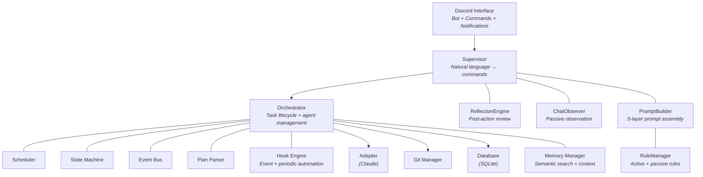

# Architecture

## Overview

Agent Queue is a single-process Python daemon that orchestrates AI coding agents through a Discord interface. The system is designed around the constraint of throttled AI API plans — maximizing token utilization by keeping agents busy and automatically recovering from rate limits.

## System Components

## Key Design Decisions

> See [[specs/design/guiding-design-principles|Guiding Design Principles]] for the full design philosophy.

### Zero LLM Overhead for Orchestration

The [[specs/scheduler-and-budget|scheduler]] and task routing use no LLM calls. Every token the system spends is a token an agent spends on actual work. Scheduling decisions are made via proportional credit-weight allocation.

### Spec-Driven Development

Each module has a corresponding specification in the `specs/` directory. These specs serve as the source of truth for behavior and are written in plain English describing *what* the module should do, not *how*.

### Async-First

All I/O operations use `asyncio`. The main event loop runs the Discord bot, the scheduling cycle, and agent monitoring concurrently.

### SQLite Persistence

All state is persisted to SQLite via `aiosqlite`. The system survives restarts and picks up exactly where it left off.

## Module Reference

| Module | Purpose |
|--------|---------|
| `src/main.py` | Entry point, signal handling, restart support |
| `src/orchestrator.py` | Core task/agent lifecycle management ([[specs/orchestrator|spec]]) |
| `src/models.py` | Data models (Task, Agent, Project, Hook, etc.) |
| `src/database.py` | SQLite persistence layer (19 tables) ([[specs/database|spec]]) |
| `src/config.py` | YAML config loading with environment variable substitution |
| `src/scheduler.py` | Proportional credit-weight scheduling ([[specs/scheduler-and-budget|spec]]) |
| `src/state_machine.py` | Task state transitions and DAG validation |
| `src/event_bus.py` | Async pub/sub with wildcard support ([[specs/event-bus|spec]]) |
| `src/plan_parser.py` | Plan file parsing (regex + LLM) |
| `src/hooks.py` | Hook engine for automation ([[specs/hooks|spec]]) |
| `src/supervisor.py` | LLM-powered conversation interface ([[specs/supervisor|Supervisor]]) |
| `src/prompt_builder.py` | 5-layer prompt assembly pipeline |
| `src/rule_manager.py` | Active/passive rule system with hook generation ([[specs/rule-system|spec]]) |
| `src/reflection.py` | Post-action reflection engine |
| `src/chat_observer.py` | Passive observation (ignore/memory/suggest) |
| `src/memory.py` | Semantic search and context retrieval |
| `src/adapters/` | Agent adapter interface and implementations |
| `src/chat_providers/` | LLM provider abstraction (Anthropic, Ollama) |
| `src/discord/` | Discord bot, commands, and notifications |
| `src/git/` | Git operations (branch management, worktrees, sync-merge) |
| `src/tokens/` | Token budget tracking |

For detailed module documentation, see the [[specs/design/README|specifications]].
