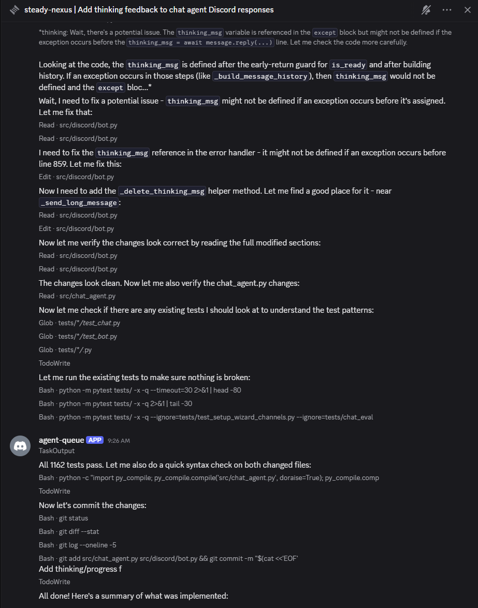
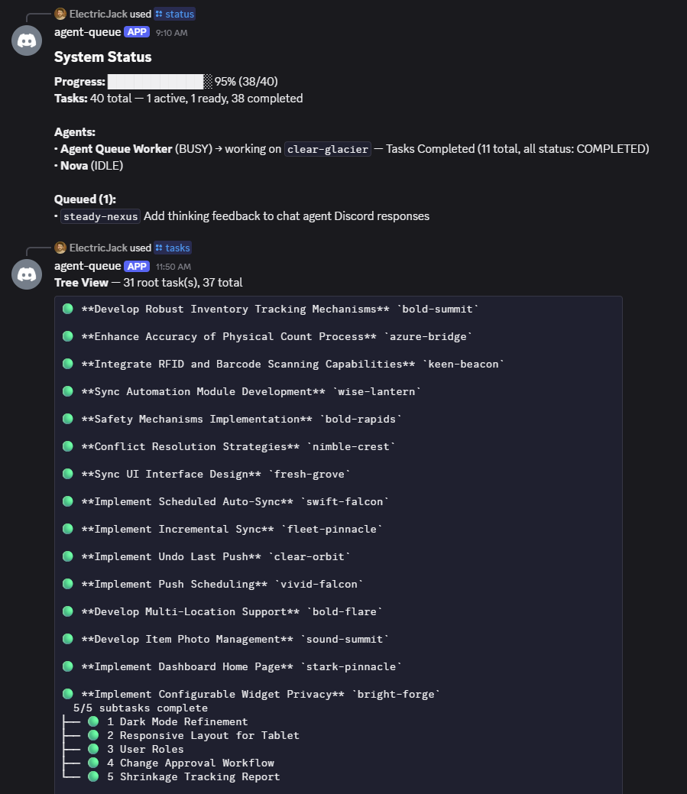

# Agent Queue

**An AI orchestration system that learns, adapts, and improves with every task.**

Agent Queue started as a way to keep AI agents busy on throttled API plans. It's grown into a self-improving orchestration platform — one that doesn't just run tasks, but accumulates knowledge, automates workflows, and gets better at its job over time.

The tokens-on-the-table problem is still real: if you're on Claude Max (or any subsidized plan), your budget resets every few hours whether you used it or not. The throttle lifts at 3am and there's nobody at the keyboard. Agent Queue keeps your agents working around the clock, recovers from rate limits automatically, and queues the next task before the current one finishes.

But the real value isn't just keeping agents busy — it's what happens over time. Every completed task feeds the reflection engine. Insights accumulate in scoped memory. Playbooks automate multi-step workflows. The system learns your projects, your conventions, and your preferences. The longer it runs, the better it gets.

You manage everything from Discord on your phone, your terminal, or any MCP-compatible client. Queue up a week's worth of tasks before you leave the house. Come back to a stack of completed PRs and a system that knows more about your codebase than it did yesterday.

<table>
<tr>
<td></td>
<td></td>
</tr>
</table>

## How it works

Agent Queue runs as a background daemon. You talk to it through Discord, the CLI, or an MCP client. A **Supervisor** (LLM-powered conversation interface) understands context, remembers what you were working on, and acts. Behind the scenes, a deterministic **Orchestrator** manages the task lifecycle — scheduling, dependencies, retries — without spending a single LLM token.



## Features

### Orchestration
- **Parallel agents.** Multiple Claude Code agents work simultaneously across projects, each in its own workspace with your existing environment (`.env`, `venv`, `node_modules`).
- **Full task lifecycle.** Created → assigned → branched → worked → tested → completed. Retries on failure, escalates when stuck, never silently drops work.
- **Live streaming.** Each task gets a Discord thread. Watch agents work in real time. Reply to unblock them.
- **Rate limit recovery.** When an agent hits the throttle, the task auto-pauses. When the window resets, it auto-resumes. While one agent is throttled, others keep working.
- **Proportional scheduling.** Weight projects by priority. The scheduler distributes work fairly across a rolling window — all deterministic, zero LLM overhead.

### Playbooks — Workflow Automation
- **Multi-step workflows.** Author automation as markdown files. An LLM compiles them into executable directed graphs with conditional branching and accumulated context.
- **Event-driven triggers.** Playbooks fire on system events (`task.completed`, `git.push`, `timer.24h`) and compose via event chaining.
- **Human-in-the-loop.** Pause execution at checkpoints for review. Resume with human input that flows into the conversation context.
- **Scoped automation.** System-wide, project-specific, or agent-type playbooks — each runs only where it applies.

### Memory & Self-Improvement
- **4-tier memory.** Identity (L0), Critical Facts (L1), Topic Context (L2), Deep Search (L3) — the right knowledge loaded at the right time.
- **Semantic search + KV store + temporal facts.** Milvus-backed unified storage supporting vector search, exact lookups, and time-windowed facts with full history.
- **Reflection engine.** Post-task review extracts insights and feeds them back to future agents. Deep/standard/light tiers with circuit breaker protection.
- **Knowledge consolidation.** Daily extraction of facts from task outcomes. Weekly deep consolidation organizes them into structured knowledge bases.
- **Scoped knowledge.** System → Agent-Type → Project hierarchy. Knowledge flows from broad to specific.

### Extensibility
- **Plugin system.** 5 internal plugins ship by default. Install third-party plugins from git repos. Plugins register tools, events, cron jobs, CLI commands, and Discord slash commands.
- **Agent profiles.** Configure agent behavior, tools, and MCP servers via markdown profiles. Assign per-project or per-task.
- **MCP server.** ~100 tools auto-exposed via Model Context Protocol. Connect from Claude Code, Cursor, or any MCP client.
- **Multi-provider.** Anthropic direct, AWS Bedrock, Google Vertex AI, Gemini, or Ollama.

### Operations
- **Token tracking.** Per-project and per-task usage breakdowns. Fair-share budgets. Daily playbook token caps.
- **Crash recovery.** SQLite-backed state. Survives restarts. Dead agents detected, tasks rescheduled, timers resumed.
- **Vault & Obsidian.** All knowledge, playbooks, and profiles stored as markdown in `~/.agent-queue/vault/`. Browse with Obsidian, edit with any text editor.
- **Zero orchestration overhead.** No LLM calls for scheduling. Every token goes to agent work.



## Why Agent Queue?

- **Self-improving.** The system gets better with use. Reflection extracts insights, memory preserves them, playbooks act on them.
- **Built for throttled plans.** Auto-pauses on rate limits, auto-resumes when the window resets. Works overnight, works while you're out, works while you sleep.
- **Development-specific.** Git branches, test verification, merge conflict handling, workspace isolation. Not calendar automation.
- **Transparent.** Everything is markdown files in a vault. Nothing is hidden in opaque databases or API calls.
- **Lightweight.** One Python process, SQLite. Runs on a Raspberry Pi. No Redis, no Kubernetes.
- **You're in control.** Nothing merges, nothing deploys without you seeing it. Discord notifications keep you in the loop from your phone.

## Getting started

### Prerequisites

- Python 3.12+
- A Discord bot token ([create one here](https://discord.com/developers/applications))
- Claude Code installed and configured

### Install & setup

```bash
git clone https://github.com/ElectricJack/agent-queue.git
cd agent-queue
./setup.sh
```

The setup script installs dependencies and walks you through Discord configuration, API keys, and getting your first agent running.

### First steps in Discord

Once the bot is online, everything happens through conversation in your control channel:

```
You:  link ~/code/my-app as my-app
Bot:  ✓ Linked. Repo "my-app" registered.

You:  create a project called my-app
Bot:  ✓ Project my-app created.

You:  create agent claude-1 and assign it to my-app
Bot:  ✓ Agent claude-1 created.

You:  add a task to add rate limiting to the API
Bot:  Created task `task-1` — "Add rate limiting to API"
      Assigned to claude-1. I'll post updates in the thread.
```

## Next steps

**Guides:**
- [[guides/getting-started|Getting Started]] — Installation and setup
- [[guides/discord-commands|Discord Commands]] — Slash commands and chat interactions
- [[guides/architecture|Architecture]] — How the system is designed
- [[guides/cli|CLI]] — Terminal interface reference
- [[guides/agent-tools|Agent Tools]] — Tool reference for AI agents
- [[guides/adapter-development|Adapter Development]] — Adding new agent backends

**Specifications:**
- [[specs/design/README|Design Specs]] — Guiding principles, playbooks, memory, self-improvement
- [[specs/orchestrator|Orchestrator]] — Core task and agent lifecycle
- [[specs/supervisor|Supervisor]] — LLM conversation loop and reflection
- [[specs/models-and-state-machine|Models & State Machine]] — Task lifecycle states

## License

MIT
