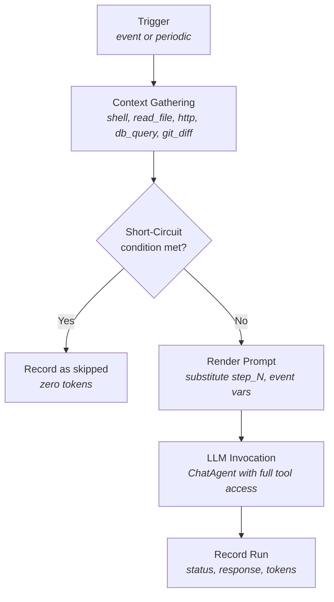
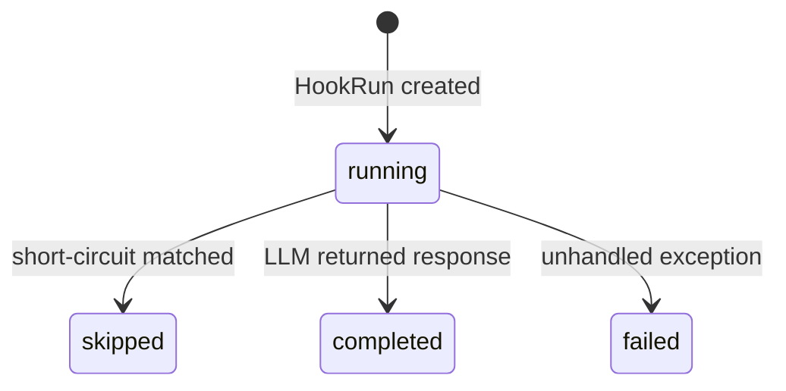

# Hook Engine Specification

**Source file:** `src/hooks.py`
**Related models:** `src/models.py` (`Hook`, `HookRun`)
**Related config:** `src/config.py` (`HookEngineConfig`, `ChatProviderConfig`)

---

## 1. Overview

The `HookEngine` class implements a generic, event-driven automation layer that runs
alongside the main orchestrator loop. Its purpose is to let operators attach
executable reactions to system events or scheduled intervals without writing custom
code.

The pipeline for every hook execution follows four stages:



The LLM call is optional: if any step's skip condition is satisfied after context
gathering, the pipeline halts before calling the LLM and the run is recorded with
`status = "skipped"`.

All orchestration is synchronous and deterministic — no LLM tokens are spent on
deciding whether to run a hook.

## Source Files
- `src/hooks.py`

---

## 2. Hook Data Model

A hook is persisted as a `Hook` dataclass in the `hooks` table:

| Field | Type | Description |
|---|---|---|
| `id` | `str` | Unique identifier |
| `project_id` | `str` | Owning project |
| `name` | `str` | Human-readable label |
| `enabled` | `bool` | Whether the engine considers this hook (default `True`) |
| `trigger` | `str` | JSON object — see Trigger Types below |
| `context_steps` | `str` | JSON array — see Context Gathering below |
| `prompt_template` | `str` | Template string with `{{...}}` placeholders |
| `llm_config` | `str \| None` | JSON object overriding the global chat provider |
| `cooldown_seconds` | `int` | Minimum seconds between two executions (default `3600`) |
| `max_tokens_per_run` | `int \| None` | Reserved for future enforcement |
| `created_at` / `updated_at` | `float` | Unix timestamps |

---

## 3. Hook Lifecycle

### 3.1 Trigger Types

A hook's `trigger` field is a JSON object with a `type` key. Two types are supported.

#### Event-Driven (`type: "event"`)

```json
{
    "type": "event",
    "event_type": "task_completed"
}
```

The engine subscribes to every event on the `EventBus` using a wildcard (`"*"`).
When an event fires, `_on_event` receives the event payload dict. The engine then
queries all enabled hooks and checks each one in order:

1. Skip hooks already in-flight (`hook.id in self._running`).
2. Skip hooks whose trigger type is not `"event"`.
3. Skip hooks whose `event_type` does not match the incoming `_event_type` field.
4. Apply the cooldown check (see 3.3).
5. Apply the global concurrency cap (see 3.4) — if the cap is reached, stop examining
   further hooks (`break`).
6. If all checks pass, launch the hook with `trigger_reason = "event:<event_type>"`.

The full event payload dict is passed through as `event_data` and made available
inside context steps and the prompt template.

#### Periodic (`type: "periodic"`)

```json
{
    "type": "periodic",
    "interval_seconds": 7200
}
```

Periodic hooks are checked during each call to `tick()`, which the orchestrator
invokes approximately every 5 seconds. For each enabled hook in the list, the engine
iterates and applies the following checks in order:

1. Apply the global concurrency cap (see 3.4) — if the cap is reached, stop examining
   further hooks for this cycle entirely (`break`).
2. Skip hooks already in-flight (`hook.id in self._running`).
3. Skip hooks whose trigger type is not `"periodic"`.
4. Elapsed time since last run `>= interval_seconds` (default `3600` if omitted).
5. Cooldown check (see 3.3).

If all checks pass, the hook is launched with `trigger_reason = "periodic"`.

### 3.2 Execution Entry Point

Both trigger types ultimately call `_launch_hook`, which:

1. Records the current time in `self._last_run_time[hook.id]` immediately (before
   the async task starts) so that a rapid second trigger cannot race past the
   cooldown.
2. Creates an `asyncio.Task` wrapping `_execute_hook`.
3. Stores the task in `self._running[hook.id]`.

Completed tasks are cleaned up at the start of each `tick()` call. If a task raised
an unhandled exception it is logged at `ERROR` level at that point.

### 3.3 Cooldown Logic

The cooldown is enforced by `_check_cooldown(hook, now)`:

```python
return (now - self._last_run_time.get(hook.id, 0)) >= hook.cooldown_seconds
```

- `_last_run_time` is an in-memory dict keyed by `hook.id`.
- On `initialize()`, the last run time for each hook is pre-populated from the
  database (see Section 8).
- `_launch_hook` updates `_last_run_time` immediately upon launch, not on
  completion, preventing simultaneous overlapping runs.
- The `fire_hook` manual trigger bypasses the cooldown check entirely but still
  updates `_last_run_time` to prevent an immediate automatic re-run.

### 3.4 Concurrency Limits

The global cap is read from `config.hook_engine.max_concurrent_hooks` (default
`2`). Before launching any hook — in both `tick()` and `_on_event` — the engine
checks:

```python
if len(self._running) >= max_concurrent:
    break  # Stop evaluating further hooks for this cycle
```

If the cap is reached, no further hooks are examined until the next cycle or event.
A hook already tracked in `self._running` (even if its task has completed but not
yet been cleaned up by `tick()`) counts toward the cap.

---

## 4. Context Gathering

After a hook is triggered, `_run_context_steps` executes each step in the
`context_steps` JSON array **sequentially**. Earlier step results are available to
later steps through the shared `step_results` list, which is also available in the
prompt template.

Each step returns a dict. On exception, the dict contains `{"error": "<message>"}`.
Every result also has `_step_index` appended (the zero-based position in the array).

### 4.1 Step Type: `shell`

Runs a shell command asynchronously using `asyncio.create_subprocess_shell`.

**Inputs (from step config):**

| Key | Type | Default | Description |
|---|---|---|---|
| `command` | `str` | `""` | Shell command string |
| `timeout` | `int` | `60` | Seconds before the process is killed |

**Output dict:**

| Key | Description |
|---|---|
| `stdout` | Captured stdout, UTF-8 decoded, truncated to 50,000 characters |
| `stderr` | Captured stderr, UTF-8 decoded, truncated to 10,000 characters |
| `exit_code` | Process return code, or `-1` on timeout |

On timeout the process is killed and `exit_code` is set to `-1` with a descriptive
`stderr` message.

### 4.2 Step Type: `read_file`

Reads a local file synchronously (within the async loop via a blocking open call).

**Inputs:**

| Key | Type | Default | Description |
|---|---|---|---|
| `path` | `str` | `""` | Absolute or relative filesystem path |
| `max_lines` | `int` | `500` | Maximum number of lines to read |

**Output dict:**

| Key | Description |
|---|---|
| `content` | Lines joined with `\n`, stripped of trailing newlines |
| `error` | Present only if an exception occurred (e.g., file not found) |

### 4.3 Step Type: `http`

Makes a GET HTTP request using `urllib.request` (run in a thread via
`asyncio.to_thread`).

**Inputs:**

| Key | Type | Default | Description |
|---|---|---|---|
| `url` | `str` | `""` | Full URL |
| `timeout` | `int` | `30` | Request timeout in seconds |

**Output dict:**

| Key | Description |
|---|---|
| `body` | Response body, UTF-8 decoded, truncated to 50,000 characters |
| `status_code` | HTTP status code; `0` on network-level error |
| `error` | Present on non-HTTP exceptions |

HTTP errors (4xx/5xx) are captured as `HTTPError` with the error message as `body`
and the numeric code as `status_code`. They do not raise; they return an error dict.

### 4.4 Step Type: `db_query`

Executes a named read-only SQL query against the application database.

**Inputs:**

| Key | Type | Description |
|---|---|---|
| `query` | `str` | Name of a query from the `NAMED_QUERIES` registry |
| `params` | `dict` | Named parameters for the query |

Param values that are `{{...}}` placeholders are resolved against `event_data`
before the query runs (using `_resolve_placeholder`).

**Available named queries:**

| Name | Description |
|---|---|
| `recent_task_results` | Last 20 tasks with their results, joined from `tasks` and `task_results` |
| `task_detail` | Single task detail by `:task_id` parameter |
| `recent_events` | Last 50 rows from the `events` table |
| `hook_runs` | Last 10 hook runs for a given `:hook_id` parameter |

Raw SQL is not accepted; any unrecognised `query` name returns `{"error": "Unknown query: ..."}`.

**Output dict:**

| Key | Description |
|---|---|
| `rows` | List of row dicts |
| `count` | Number of rows returned |
| `error` | Present on SQL exception |

### 4.5 Step Type: `git_diff`

Runs `git diff <base_branch>...HEAD` in a given workspace directory.

**Inputs:**

| Key | Type | Default | Description |
|---|---|---|---|
| `workspace` | `str` | `"."` | Working directory for the git command |
| `base_branch` | `str` | `"main"` | Branch to diff against |

**Output dict:**

| Key | Description |
|---|---|
| `diff` | Diff output, UTF-8 decoded, truncated to 50,000 characters |
| `exit_code` | Git process return code |
| `error` | Present on exception (e.g., not a git repo) |

Timeout is hardcoded at 30 seconds.

---

## 5. Short-Circuit (Skip) Conditions

After all context steps complete, `_should_skip_llm` iterates over each step config
and its corresponding result. The first matching condition causes the entire LLM
invocation to be skipped.

| Step config flag | Condition to skip |
|---|---|
| `skip_llm_if_exit_zero: true` | `exit_code == 0` in the step result |
| `skip_llm_if_empty: true` | `stdout + content` is blank or whitespace |
| `skip_llm_if_status_ok: true` | `status_code` is in the range `[200, 300)` |

When skipped, `_execute_hook` records the run with:

- `status = "skipped"`
- `skipped_reason = "step_<N>: <description>"`
- `completed_at = time.time()`

No prompt is rendered and no LLM call is made.

---

## 6. Prompt Template System

The `prompt_template` field of a `Hook` is a string that may contain `{{...}}`
placeholders. `_render_prompt` replaces all placeholders using a regex
(`\{\{(.+?)\}\}`) before the string is sent to the LLM.

### Placeholder Syntax

| Placeholder | Resolves to |
|---|---|
| `{{step_N}}` | The primary output of step N. Tries `stdout`, `content`, `body`, `diff` in that order; falls back to `json.dumps(result)` if none are present |
| `{{step_N.field}}` | A specific field from step N's result dict, e.g. `{{step_0.exit_code}}` |
| `{{event}}` | The full `event_data` dict serialised as JSON |
| `{{event.field}}` | A single field from `event_data`, e.g. `{{event.task_id}}` |

Unrecognised placeholders are left unchanged (the original `{{...}}` text is
returned by `_resolve_placeholder`).

### Parameter Resolution in `db_query` Steps

The same `_resolve_placeholder` function is used to resolve `{{...}}` values inside
`db_query` step `params` before the query executes. However, `_step_db_query` passes
an empty list as `step_results` when calling `_resolve_placeholder`, so only
`{{event.field}}` and `{{event}}` patterns are meaningful — step result references
such as `{{step_0.stdout}}` will always resolve to an empty string.

---

## 7. LLM Invocation

LLM invocation happens in `_invoke_llm` when the pipeline is not short-circuited.

### Provider Selection

If `hook.llm_config` is set (a JSON object), it is parsed and merged with global
defaults to produce a `ChatProviderConfig`:

```json
{
    "provider": "anthropic",
    "model": "claude-opus-4-6",
    "base_url": ""
}
```

Any keys absent from `hook.llm_config` fall back to the corresponding value in
`config.chat_provider`. If `hook.llm_config` is `None`, the global
`config.chat_provider` is used without modification.

### Invocation Mechanism

`_invoke_llm` creates a `ChatAgent` instance (from `src/chat_agent.py`) with a
reference to the owning `Orchestrator`. It replaces the agent's `_provider` with one
created from the resolved `ChatProviderConfig`. The hook prompt is passed as a user
message via `chat_agent.chat(text=prompt, user_name="hook:<hook_name>")`.

This means the LLM has access to all tools registered in `ChatAgent` — the same set
available to a human operator typing in Discord. The hook can therefore issue
commands, create tasks, update projects, etc.

### Token Counting

Because `chat_agent.chat()` does not return an exact token count, tokens are
estimated post-hoc:

```python
tokens = len(prompt) // 4 + len(response) // 4
```

This is a character-count approximation (4 characters per token). The value is
stored in `HookRun.tokens_used` for record-keeping but is not used for budget
enforcement.

---

## 8. Hook Run Recording

Every execution creates a `HookRun` record that is updated progressively through
the pipeline.

### HookRun Fields

| Field | Type | Description |
|---|---|---|
| `id` | `str` | First 12 characters of a UUID4 |
| `hook_id` | `str` | Foreign key to the `hooks` table |
| `project_id` | `str` | Copied from the `Hook` at run time |
| `trigger_reason` | `str` | `"periodic"`, `"event:<type>"`, or `"manual"` |
| `status` | `str` | `running` → `completed` / `failed` / `skipped` |
| `event_data` | `str \| None` | JSON-serialised `event_data` dict |
| `context_results` | `str \| None` | JSON-serialised list of step result dicts |
| `prompt_sent` | `str \| None` | Fully rendered prompt string |
| `llm_response` | `str \| None` | LLM reply text, or exception message on failure |
| `actions_taken` | `str \| None` | Reserved; not written by current implementation |
| `skipped_reason` | `str \| None` | Human-readable skip reason when `status = "skipped"` |
| `tokens_used` | `int` | Estimated token count (see Section 7) |
| `started_at` | `float` | Unix timestamp set at run creation |
| `completed_at` | `float \| None` | Unix timestamp set on terminal status transition |

### Status Transitions



- **skipped**: short-circuit condition matched; `skipped_reason` is set.
- **completed**: LLM returned a response; `llm_response` and `tokens_used` are set.
- **failed**: any unhandled exception; `llm_response` holds the exception string.

The `context_results` field is written after step execution regardless of the
terminal status — it captures whatever was gathered before the failure or skip.

---

## 9. Manual Triggering

`fire_hook(hook_id: str) -> str` allows an administrator to run a hook immediately,
bypassing the cooldown and periodic scheduling checks.

**Behaviour:**

1. Fetches the `Hook` from the database; raises `ValueError` if not found.
2. Raises `ValueError` if the hook is already in `self._running`.
3. Updates `_last_run_time[hook.id]` to the current time (prevents an immediate
   automatic re-run after the manual fire).
4. Creates an `asyncio.Task` for `_execute_hook` with `trigger_reason = "manual"`.
5. Stores the task in `self._running`.
6. Returns `hook.id` (not the run ID) to the caller.

Note: the return value is `hook.id`, not the `HookRun.id`. The run record's ID is
generated inside `_execute_hook` and is not surfaced back to the caller.

---

## 10. Initialization

`initialize()` is called once during system startup before the orchestrator loop
begins.

1. **EventBus subscription:** Calls `self.bus.subscribe("*", self._on_event)`. The
   wildcard means every published event on the bus is delivered to `_on_event`.

2. **Pre-populate last run times:** Queries `db.list_hooks(enabled=True)` to get all
   active hooks. For each hook, calls `db.get_last_hook_run(hook.id)`. If a record
   is found, sets `self._last_run_time[hook.id] = last_run.started_at`.

   This prevents hooks from firing immediately on startup just because their
   `interval_seconds` has technically elapsed (the last run happened before the
   current process started).

**Dependency injection:** The `HookEngine` constructor does not accept an
`Orchestrator` reference directly. The orchestrator must call
`hook_engine.set_orchestrator(self)` after construction. `_invoke_llm` reads
`self._orchestrator`; calling `_invoke_llm` before `set_orchestrator` will raise an
`AttributeError`.

---

## 11. Shutdown

`shutdown()` cancels all in-flight asyncio tasks and waits for them to finish.

```python
for hook_id, task in self._running.items():
    if not task.done():
        task.cancel()
await asyncio.gather(*self._running.values(), return_exceptions=True)
self._running.clear()
```

`return_exceptions=True` ensures a `CancelledError` from a cancelled task does not
propagate and abort the gather. After the gather completes, `self._running` is
cleared. Hook runs that were cancelled mid-execution will remain in the database with
`status = "running"` because the cancellation interrupts the coroutine before the
final `update_hook_run` call.

---

## 12. Configuration Reference

`HookEngineConfig` (from `src/config.py`):

| Field | Type | Default | Description |
|---|---|---|---|
| `enabled` | `bool` | `True` | Master switch; if `False` the orchestrator does not call `tick()` |
| `max_concurrent_hooks` | `int` | `2` | Maximum number of hooks that may execute simultaneously |

YAML config path: `hook_engine` top-level key.

```yaml
hook_engine:
  enabled: true
  max_concurrent_hooks: 3
```
