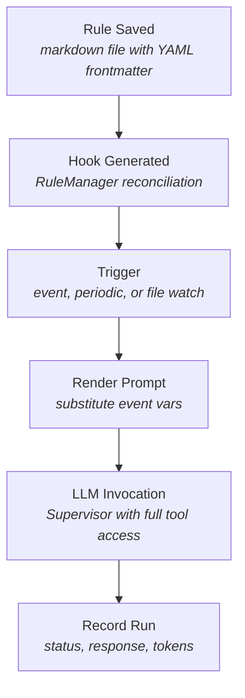
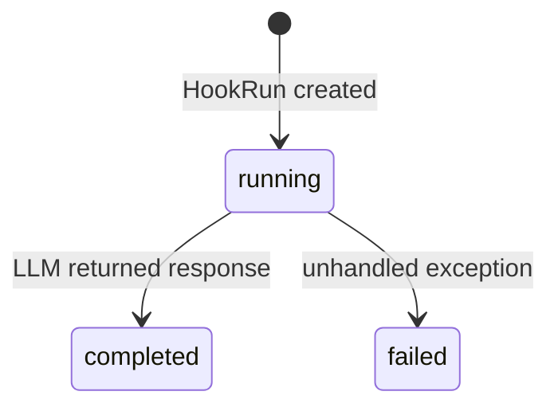

# Hook Engine Specification

**Source files:** `src/hooks.py`, `src/file_watcher.py`
**Related models:** [[models]] (`Hook`, `HookRun`)
**Related config:** [[config]] (`HookEngineConfig`, `ChatProviderConfig`)

---

## 1. Overview

> **Future evolution:** The hook engine will be replaced by [[design/playbooks|playbooks]]. See [[design/playbooks]] for the planned migration.

The `HookEngine` class implements a generic, event-driven automation layer that runs
alongside the main orchestrator loop. Hooks are **internal execution artifacts** —
they are always generated from rules and should not be created or edited directly.

The automation model follows a unified pipeline:



The supervisor has shell, file I/O, and task management tools, so hooks can run
commands, read files, create tasks, etc. — anything a human user can do via Discord
chat, a hook can do autonomously. The prompt template should contain specific,
actionable instructions so the supervisor can execute reliably.

All orchestration is synchronous and deterministic — no LLM tokens are spent on
deciding whether to run a hook.

## Source Files
- `src/hooks.py` — hook engine, prompt rendering, LLM invocation, Discord notifications
- `src/file_watcher.py` — mtime-based file/folder change detection, debouncing

---

## 2. Hook Provenance — All Hooks Are Rule-Generated

**Rules are the only interface for creating automation.** Hooks are derived, disposable
execution artifacts managed by the `RuleManager`. Users interact with rules; the system
manages hooks.

### Lifecycle

```
Rule saved (markdown file) → RuleManager reconciliation → Hook(s) created in DB
                                                           → Hook engine fires on trigger
                                                           → HookRun recorded
```

### Source Tracking

Every hook traces back to its source rule:

| Field | Description |
|---|---|
| `id` prefix | Rule-generated hooks have IDs prefixed with `rule-{rule_id}-` |
| `source_hash` | Content hash of the rule's trigger config + prompt. Used for idempotent reconciliation — if the hash hasn't changed, the hook is not regenerated. |

### Why No Direct Hook Creation

Previously, hooks could be created directly via `create_hook` or `edit_hook` commands.
This led to:
- **Duplicate hooks** from concurrent reconciliation runs
- **Orphan hooks** invisible to rule management
- **State confusion** when direct edits were overwritten by reconciliation

The unified model eliminates these problems by making rules the single source of truth.

### Legacy Hook Migration

Existing hooks that were created directly (not via rules) are automatically migrated
to rule-backed hooks on startup. The `migrate_orphan_hooks()` method:
1. Finds hooks without a `rule-` ID prefix
2. Generates a rule markdown file from the hook's configuration
3. Lets reconciliation regenerate the hook with proper rule backing
4. Deletes the original orphan hook

This migration is idempotent — re-running it skips already-migrated hooks.

---

## 3. Hook Data Model

A hook is persisted as a `Hook` dataclass in the `hooks` table:

| Field | Type | Description |
|---|---|---|
| `id` | `str` | Unique identifier (prefixed `rule-{rule_id}-` for rule-generated hooks) |
| `project_id` | `str` | Owning project |
| `name` | `str` | Human-readable label |
| `enabled` | `bool` | Whether the engine considers this hook (default `True`) |
| `trigger` | `str` | JSON object — see Trigger Types below |
| `prompt_template` | `str` | Template string with `{{...}}` placeholders |
| `llm_config` | `str \| None` | JSON object overriding the global chat provider |
| `cooldown_seconds` | `int` | Minimum seconds between two executions (default `3600`) |
| `source_hash` | `str \| None` | Content hash of the source rule (for idempotent reconciliation) |
| `max_tokens_per_run` | `int \| None` | Reserved for future enforcement |
| `last_triggered_at` | `float \| None` | Epoch seconds of last trigger, persisted across restarts |
| `created_at` / `updated_at` | `float` | Unix timestamps |

---

## 4. Hook Lifecycle

### 4.1 Trigger Types

A hook's `trigger` field is a JSON object with a `type` key. Two types are supported.

#### Event-Driven (`type: "event"`)

```json
{
    "type": "event",
    "event_type": "task.completed"
}
```

The engine subscribes to every event on the `EventBus` using a wildcard (`"*"`).
When an event fires, `_on_event` receives the event payload dict. The engine then
queries all enabled hooks and checks each one in order:

1. Skip hooks already in-flight (`hook.id in self._running`).
2. Skip hooks whose trigger type is not `"event"`.
3. Skip hooks whose `event_type` does not match the incoming `_event_type` field.
4. **Project-scoped filtering:** if the event payload contains a `project_id` and it
   does not match the hook's `project_id`, skip the hook. This ensures hooks only fire
   for events in their owning project.
5. Apply the cooldown check (see 4.3).
6. Apply the global concurrency cap (see 4.4) — if the cap is reached, stop examining
   further hooks (`break`).
7. If all checks pass, launch the hook with `trigger_reason = "event:<event_type>"`.

The full event payload dict is passed through as `event_data` and made available
inside the prompt template.

**Available event types:**

| Event | Emitted by | Payload fields |
|---|---|---|
| `task.completed` | Orchestrator | `task_id`, `project_id`, `title`, `status` |
| `task.failed` | Orchestrator | `task_id`, `project_id`, `title`, `error` |
| `note.created` | CommandHandler | `project_id`, `note_name`, `note_path`, `title`, `operation` |
| `note.updated` | CommandHandler | `project_id`, `note_name`, `note_path`, `title`, `operation` |
| `note.deleted` | CommandHandler | `project_id`, `note_name`, `note_path`, `title`, `operation` |
| `file.changed` | FileWatcher | `path`, `relative_path`, `project_id`, `operation`, `old_mtime`, `new_mtime`, `size`, `watch_id` |
| `folder.changed` | FileWatcher | `path`, `project_id`, `changes` (list of `{path, operation}`), `count`, `watch_id` |

#### File and Folder Watch Triggers

For `file.changed` and `folder.changed` events, the trigger includes a `watch`
configuration block that registers a `WatchRule` with the `FileWatcher`:

```json
{
    "type": "event",
    "event_type": "file.changed",
    "watch": {
        "paths": ["pyproject.toml", "src/config.py"],
        "project_id": "my-project"
    }
}
```

```json
{
    "type": "event",
    "event_type": "folder.changed",
    "watch": {
        "paths": ["docs/", "specs/"],
        "recursive": true,
        "extensions": [".md", ".rst"],
        "project_id": "my-project"
    }
}
```

| Watch config key | Type | Default | Description |
|---|---|---|---|
| `paths` | `list[str]` | required | Files or directories to watch |
| `project_id` | `str` | hook's project | Override the project scope |
| `base_dir` | `str` | project workspace | Base directory for relative paths |
| `recursive` | `bool` | `false` | Descend into subdirectories (folder watches only) |
| `extensions` | `list[str]` | all | Filter by file extension (folder watches only) |

The `FileWatcher` uses mtime-based polling (configurable interval, default 10s).
Folder changes are debounced over a configurable window (default 5s) to prevent
event storms from bulk operations like `git checkout`. Change deduplication logic:
created then modified = report "created"; created then deleted = cancel out (no event);
modified then deleted = report "deleted".

Watch rules are synchronized from hook configs at `initialize()` and whenever hooks
are added/removed. Watches for disabled or deleted hooks are automatically cleaned up.

#### Periodic (`type: "periodic"`)

```json
{
    "type": "periodic",
    "interval_seconds": 7200
}
```

Periodic hooks are checked during each call to `tick()`, which the orchestrator
invokes approximately every 5 seconds. For each enabled hook in the list, the engine
iterates and applies the following checks in order:

1. Apply the global concurrency cap (see 4.4) — if the cap is reached, stop examining
   further hooks for this cycle entirely (`break`).
2. Skip hooks already in-flight (`hook.id in self._running`).
3. Skip hooks whose trigger type is not `"periodic"`.
4. Elapsed time since last run `>= interval_seconds` (default `3600` if omitted).
5. Cooldown check (see 4.3).

If all checks pass, the hook is launched with `trigger_reason = "periodic"` and
an `event_data` dict containing timing context:

| Key | Type | Description |
|---|---|---|
| `current_time` | `str` (ISO 8601) | Current UTC timestamp |
| `current_time_epoch` | `float` | Current time as Unix epoch |
| `last_run_time` | `str` (ISO 8601) | Previous run UTC timestamp (omitted on first run) |
| `last_run_time_epoch` | `float` | Previous run as Unix epoch (omitted on first run) |
| `seconds_since_last_run` | `float` | Seconds elapsed since previous run (omitted on first run) |

This timing data is available in prompt templates as `{{event.current_time}}`,
`{{event.last_run_time}}`, etc., and is also rendered into the context preamble
so the LLM can scope its work to changes since the last execution.

### 4.2 Execution Entry Point

Both trigger types ultimately call `_launch_hook`, which:

1. Records the current time in `self._last_run_time[hook.id]` immediately (before
   the async task starts) so that a rapid second trigger cannot race past the
   cooldown.
2. Creates an `asyncio.Task` wrapping `_execute_hook`.
3. Stores the task in `self._running[hook.id]`.

Completed tasks are cleaned up at the start of each `tick()` call. If a task raised
an unhandled exception it is logged at `ERROR` level at that point.

### 4.3 Cooldown Logic

The cooldown is enforced by `_check_cooldown(hook, now)`:

```python
return (now - self._last_run_time.get(hook.id, 0)) >= hook.cooldown_seconds
```

- `_last_run_time` is an in-memory dict keyed by `hook.id`.
- On `initialize()`, the last run time for each hook is pre-populated from the
  database (see Section 9).
- `_launch_hook` updates `_last_run_time` immediately upon launch, not on
  completion, preventing simultaneous overlapping runs.
- The `fire_hook` manual trigger bypasses the cooldown check entirely but still
  updates `_last_run_time` to prevent an immediate automatic re-run.

### 4.4 Concurrency Limits

The global cap is read from `config.hook_engine.max_concurrent_hooks` (default
`2`). Before launching any hook — in both `tick()` and `_on_event` — the engine
checks:

```python
if len(self._running) >= max_concurrent:
    break  # Stop evaluating further hooks for this cycle
```

If the cap is reached, no further hooks are examined until the next cycle or event.
A hook already tracked in `self._running` (even if its task has completed but not
yet been cleaned up by `tick()`) counts toward the cap.

---

## 5. Prompt Template System

The `prompt_template` field of a `Hook` is a string that may contain `{{...}}`
placeholders. `_render_prompt` replaces all placeholders using a regex
(`\{\{(.+?)\}\}`) before the string is sent to the LLM.

### Placeholder Syntax

| Placeholder | Resolves to |
|---|---|
| `{{event}}` | The full `event_data` dict serialised as JSON |
| `{{event.field}}` | A single field from `event_data`, e.g. `{{event.task_id}}` |

Unrecognised placeholders are left unchanged.

---

## 6. LLM Invocation

LLM invocation happens in `_invoke_llm` after prompt rendering.

### Provider Selection

If `hook.llm_config` is set (a JSON object), it is parsed and merged with global
defaults to produce a `ChatProviderConfig`:

```json
{
    "provider": "anthropic",
    "model": "claude-opus-4-6",
    "base_url": ""
}
```

Any keys absent from `hook.llm_config` fall back to the corresponding value in
`config.chat_provider`. If `hook.llm_config` is `None`, the global
`config.chat_provider` is used without modification.

### Context Preamble

Before invoking the LLM, `_invoke_llm` calls `_build_hook_context` to generate a
preamble prepended to the rendered prompt. The preamble includes:

- Hook name, project name, project ID, workspace path
- Trigger reason (periodic, event, manual)
- Repository URL and default branch (if available)
- **Timing context** (periodic hooks only): current time, last run time, and elapsed
  seconds since the previous run. On the first run, only current time is shown.

The preamble is rendered from the `hook-context` prompt template
(`src/prompts/hook_context.md`).

### Hook Context Preamble

The hook context preamble is assembled using `PromptBuilder` (see `specs/prompt-builder.md`).
`_build_hook_context()` uses `PromptBuilder.set_identity("hook-context")` with project
metadata variables. Hook-specific placeholder substitution (`{{event}}`)
remains in the hook engine's `_render_prompt()` method.

### Invocation Mechanism

`_invoke_llm` creates a `ChatAgent` instance (from `src/chat_agent.py`) with a
reference to the owning `Orchestrator`. It replaces the agent's `_provider` with one
created from the resolved `ChatProviderConfig`. The hook prompt is passed as a user
message via `chat_agent.chat(text=prompt, user_name="hook:<hook_name>")`.

This means the LLM has access to all tools registered in `ChatAgent` — the same set
available to a human operator typing in Discord. The hook can therefore issue
commands, create tasks, update projects, etc.

### Progress Tracking

An `on_progress` callback is passed to `chat_agent.chat()` to track tool calls made
by the hook's LLM. The callback collects tool names and sends live updates to the
project's Discord channel as tools are called (see Section 12).

### Token Counting

Because `chat_agent.chat()` does not return an exact token count, tokens are
estimated post-hoc:

```python
tokens = len(prompt) // 4 + len(response) // 4
```

This is a character-count approximation (4 characters per token). The value is
stored in `HookRun.tokens_used` for record-keeping but is not used for budget
enforcement.

---

## 7. Hook Run Recording

Every execution creates a `HookRun` record that is updated progressively through
the pipeline.

### HookRun Fields

| Field | Type | Description |
|---|---|---|
| `id` | `str` | First 12 characters of a UUID4 |
| `hook_id` | `str` | Foreign key to the `hooks` table |
| `project_id` | `str` | Copied from the `Hook` at run time |
| `trigger_reason` | `str` | `"periodic"`, `"event:<type>"`, or `"manual"` |
| `status` | `str` | `running` → `completed` / `failed` |
| `event_data` | `str \| None` | JSON-serialised `event_data` dict |
| `prompt_sent` | `str \| None` | Fully rendered prompt string |
| `llm_response` | `str \| None` | LLM reply text, or exception message on failure |
| `actions_taken` | `str \| None` | Reserved; not written by current implementation |
| `tokens_used` | `int` | Estimated token count (see Section 6) |
| `started_at` | `float` | Unix timestamp set at run creation |
| `completed_at` | `float \| None` | Unix timestamp set on terminal status transition |

### Status Transitions



- **completed**: LLM returned a response; `llm_response` and `tokens_used` are set.
- **failed**: any unhandled exception; `llm_response` holds the exception string.

---

## 8. Manual Triggering

`fire_hook(hook_id: str) -> str` allows an administrator to run a hook immediately,
bypassing the cooldown and periodic scheduling checks.

**Behaviour:**

1. Fetches the `Hook` from the database; raises `ValueError` if not found.
2. Raises `ValueError` if the hook is already in `self._running`.
3. Updates `_last_run_time[hook.id]` to the current time (prevents an immediate
   automatic re-run after the manual fire).
4. Creates an `asyncio.Task` for `_execute_hook` with `trigger_reason = "manual"`.
5. Stores the task in `self._running`.
6. Returns `hook.id` (not the run ID) to the caller.

Note: the return value is `hook.id`, not the `HookRun.id`. The run record's ID is
generated inside `_execute_hook` and is not surfaced back to the caller.

---

## 9. Initialization

`initialize()` is called once during system startup before the orchestrator loop
begins.

1. **EventBus subscription:** Calls `self.bus.subscribe("*", self._on_event)`. The
   wildcard means every published event on the bus is delivered to `_on_event`.

2. **Pre-populate last run times:** Queries `db.list_hooks(enabled=True)` to get all
   active hooks. For each hook, calls `db.get_last_hook_run(hook.id)`. If a record
   is found, sets `self._last_run_time[hook.id] = last_run.started_at`.

   This prevents hooks from firing immediately on startup just because their
   `interval_seconds` has technically elapsed (the last run happened before the
   current process started).

**Dependency injection:** The `HookEngine` constructor does not accept an
`Orchestrator` reference directly. The orchestrator must call
`hook_engine.set_orchestrator(self)` after construction. `_invoke_llm` reads
`self._orchestrator`; calling `_invoke_llm` before `set_orchestrator` will raise an
`AttributeError`.

---

## 10. Shutdown

`shutdown()` cancels all in-flight asyncio tasks and waits for them to finish.

```python
for hook_id, task in self._running.items():
    if not task.done():
        task.cancel()
await asyncio.gather(*self._running.values(), return_exceptions=True)
self._running.clear()
```

`return_exceptions=True` ensures a `CancelledError` from a cancelled task does not
propagate and abort the gather. After the gather completes, `self._running` is
cleared. Hook runs that were cancelled mid-execution will remain in the database with
`status = "running"` because the cancellation interrupts the coroutine before the
final `update_hook_run` call.

---

## 11. FileWatcher

The `FileWatcher` class (`src/file_watcher.py`) monitors files and directories for
changes using mtime-based polling. It is created by the `HookEngine` at
`initialize()` when `file_watcher_enabled` is `True`.

### Architecture

```
HookEngine.initialize()
├── Creates FileWatcher(bus, debounce_seconds, poll_interval)
├── _sync_file_watches() — scans hook triggers for watch configs
│   └── Registers WatchRule for each file.changed / folder.changed trigger
└── tick() calls file_watcher.check() each cycle
    ├── File watches: compare mtime, emit file.changed immediately
    └── Folder watches: accumulate changes, emit folder.changed after debounce window
```

### Rule File Watcher

In addition to hook-triggered file watches, the system runs a **Rule File Watcher**
that monitors all rule directories (`~/.agent-queue/memory/*/rules/` and
`~/.agent-queue/memory/global/rules/`). When a rule markdown file is created,
modified, or deleted on disk:

1. The file watcher detects the change (debounced at 5s)
2. Only the affected rule is reconciled (not all rules)
3. On file deletion, associated hooks are cleaned up automatically

This makes direct file editing a first-class workflow — there is no need for manual
`refresh_hooks` after editing rule files on disk.

### File Watches

Compare file mtime on each poll. Detect creation, modification, and deletion.
Emit `file.changed` event immediately when a change is detected.

### Folder Watches

Scan directory contents (optionally recursive via `os.walk()`). Accumulate
changes over a debounce window (default 5s) to prevent event storms. Apply
deduplication: created+modified = "created"; created+deleted = cancelled;
modified+deleted = "deleted". Emit `folder.changed` with aggregated change list
after the debounce window expires.

---

## 12. Discord Notifications

Hook execution progress is reported to the project's Discord channel via
`orchestrator._notify_channel()`. Four notification types are sent:

| Phase | Format |
|---|---|
| **Start** | `🪝 Hook **{name}** is running (trigger: \`{reason}\`).` |
| **Tool use** (live) | `🪝 Hook **{name}** 🔧 \`tool1\` → \`tool2\`` |
| **Completed** | `🪝 Hook **{name}** completed.` + tool chain + response summary (truncated to 4000 chars) |
| **Failed** | `🪝 Hook **{name}** failed: {error}` |

This mirrors the tool call visibility that chat agent interactions have in Discord,
where users can see `💭 Thinking...` → `🔧 Working... tool1 → tool2` → `✅ Done`.

---

## 13. Configuration Reference

`HookEngineConfig` (from `src/config.py`):

| Field | Type | Default | Description |
|---|---|---|---|
| `enabled` | `bool` | `True` | Master switch; if `False` the orchestrator does not call `tick()` |
| `max_concurrent_hooks` | `int` | `2` | Maximum number of hooks that may execute simultaneously |
| `file_watcher_enabled` | `bool` | `True` | Enable/disable the FileWatcher for file/folder change events |
| `file_watcher_poll_interval` | `float` | `10.0` | Seconds between file system polls |
| `file_watcher_debounce_seconds` | `float` | `5.0` | Debounce window for folder change aggregation |

YAML config path: `hook_engine` top-level key.

```yaml
hook_engine:
  enabled: true
  max_concurrent_hooks: 3
  file_watcher_enabled: true
  file_watcher_poll_interval: 10
  file_watcher_debounce_seconds: 5
```
