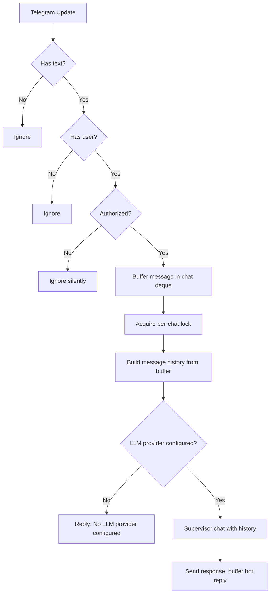

# Telegram Bot Specification

**Source files:** `src/telegram/bot.py`, `src/telegram/adapter.py`, `src/telegram/commands.py`, `src/telegram/views.py`, `src/telegram/notifications.py`
**Related:** [[messaging/base]], [[messaging/discord]], [[specs/supervisor]], [[specs/command-handler]]

> **Future evolution:** See [[design/agent-coordination]] for how messaging platforms surface workflow status and human-in-the-loop prompts.

## 1. Overview

> Shared pattern. See [[messaging/base]] for the common three-layer architecture, authorization model, message history, channel routing, thread creation, orchestrator callback wiring, notification types, and error classification. This document covers Telegram-specific implementation.

The Telegram bot provides a chat interface to Agent Queue via the `python-telegram-bot` library (async, long polling). It implements the [[messaging/base|MessagingAdapter]] interface, providing feature parity with the [[messaging/discord|Discord bot]] through the shared [[specs/command-handler|CommandHandler]] and [[specs/supervisor|Supervisor]].

Key library-level differences from the Discord implementation:

| Aspect | Discord | Telegram |
|---|---|---|
| Library | `discord.py` (`Bot` subclass) | `python-telegram-bot` (`Application` builder) |
| Connection | WebSocket gateway | Long polling (`start_polling`) |
| Rich formatting | Embeds (`discord.Embed`) | MarkdownV2 text |
| Interactive UI | Views/Buttons (`discord.ui.View`) | Inline keyboards (`InlineKeyboardMarkup`) |
| Threading | Discord threads on messages | Forum topics or reply chains |
| Message limit | 2000 characters | 4096 characters |

---

## 2. TelegramMessagingAdapter

Thin wrapper in `src/telegram/adapter.py` that delegates all `MessagingAdapter` methods to `TelegramBot`. Constructor initializes the bot with config and orchestrator.

| Method | Delegates to |
|---|---|
| `start()` | `TelegramBot.start()` |
| `wait_until_ready()` | `TelegramBot.wait_until_ready()` |
| `close()` | `TelegramBot.stop()` |
| `send_message(...)` | `TelegramBot.send_notification(...)` |
| `create_task_thread(...)` | `TelegramBot.create_task_topic(...)` |
| `get_command_handler()` | `TelegramBot.handler` |
| `get_supervisor()` | `TelegramBot.supervisor` |
| `is_connected()` | `TelegramBot._ready_event.is_set()` |
| `platform_name` | `"telegram"` |

---

## 3. TelegramBot

Core bot class in `src/telegram/bot.py`.

### 3.1 Initialization

`TelegramBot.__init__` receives `AppConfig` and `Orchestrator`. It builds the `python-telegram-bot` `Application` via the builder pattern:

```python
Application.builder().token(config.telegram.bot_token).build()
```

The `python-telegram-bot` library is imported lazily — it may not be installed in Discord-only deployments.

Key instance state initialized at construction:

| Attribute | Type | Purpose |
|---|---|---|
| `_application` | `telegram.ext.Application` | The python-telegram-bot application instance |
| `_supervisor` | `Supervisor` | LLM interface for natural language chat |
| `handler` | `CommandHandler` | Shared command handler (from Supervisor) |
| `_project_chats` | `dict[str, int]` | Forward mapping: `project_id -> chat_id` |
| `_chat_to_project` | `dict[int, str]` | Reverse mapping: `chat_id -> project_id` (O(1) lookup) |
| `_main_chat_id` | `int` | Global fallback chat ID from config (`config.telegram.chat_id`) |
| `_chat_buffers` | `dict[int, deque[CachedMessage]]` | Per-chat message buffer (maxlen=50) |
| `_buffer_last_access` | `dict[int, float]` | Last access timestamp per buffer (for idle cleanup) |
| `_chat_locks` | `dict[int, asyncio.Lock]` | Per-chat mutex for serializing LLM calls |
| `_task_topics` | `dict[int, str]` | Maps `topic_message_id -> task_id` |
| `_task_topic_ids` | `dict[str, int]` | Reverse: `task_id -> topic_message_id` (for topic reuse) |
| `_ready_event` | `asyncio.Event` | Set once the bot is connected and polling |
| `_polling_task` | `asyncio.Task \| None` | Background task handle for long polling |

After constructing instance state, the constructor:
1. Calls `register_commands(application, handler)` to wire all slash command handlers.
2. Calls `_register_message_handler()` to add the catch-all `MessageHandler` and `CallbackQueryHandler`.

### 3.2 Handler Registration

`_register_message_handler()` installs two handlers on the `Application`:

1. **MessageHandler** — `filters.TEXT & ~filters.COMMAND` — catches all non-command text messages and routes to `_handle_message`. This is the Telegram equivalent of Discord's `on_message`.
2. **CallbackQueryHandler** — catches all inline keyboard button presses and routes to `_handle_callback_query`.

### 3.3 Startup (`start`)

`start()` performs these steps in order:

1. Calls `application.initialize()` and `application.start()` to set up the bot and webhook/connection.
2. Starts long polling in a background `asyncio.Task` via `updater.start_polling(drop_pending_updates=True)`. Pending updates from before boot are dropped to avoid processing stale messages.
3. Calls `_resolve_project_chats()` to populate per-project chat routing from config (`config.telegram.per_project_chats`).
4. Initializes the Supervisor's LLM client. Logs the model name on success or a warning if no credentials are found.
5. Wires orchestrator references: `set_command_handler()` and `set_supervisor()`. Also wires `HookEngine.set_supervisor()` if hooks are configured. Notification delivery is handled through the EventBus rather than direct callbacks.
6. Sets `_ready_event`, marking the bot as connected.

### 3.4 Shutdown (`stop`)

`stop()` performs graceful shutdown:

1. Stops the updater (polling loop) if running.
2. Cancels the background polling task and awaits its cancellation.
3. Calls `application.stop()` and `application.shutdown()`.

### 3.5 Authorization

> Shared pattern. See [[messaging/base]] Section 4 for the common authorization model. This section covers Telegram-specific enforcement.

`_is_authorized(user_id)` reads `config.telegram.authorized_users` (a list of user ID strings). If the list is empty, all users are permitted. Otherwise, `str(user_id)` must appear in the list.

Authorization is checked at two points:
- **Messages** — `_handle_message` silently returns without response for unauthorized users.
- **Callback queries** — `_handle_callback_query` answers with `"Unauthorized."` (`show_alert=True`) for unauthorized users.

Commands do not have a separate auth guard (unlike Discord's `interaction_check` hook); authorization is enforced by the message handler since Telegram commands are routed as messages.

### 3.6 Chat Routing

> Shared pattern. See [[messaging/base]] Section 6 for the common channel/chat routing model. This section covers Telegram-specific resolution.

#### `_resolve_project_chats()`

Called at startup. Iterates `config.telegram.per_project_chats` (a `dict[str, str]` of `project_id -> chat_id_str`) and populates both `_project_chats` and `_chat_to_project`.

#### `_get_chat_id(project_id)`

Returns the project-specific `chat_id` if one is cached, otherwise returns `_main_chat_id`. Returns `0` if neither is available.

#### `update_project_chat(project_id, chat_id)`

Runtime update. Removes the stale reverse-mapping entry for any previously cached chat ID before adding the new one.

#### `clear_project_chats(project_id)`

Called after project deletion. Removes entries from both `_project_chats` and `_chat_to_project`.

### 3.7 Message Handling

> Shared pattern. See [[messaging/base]] Section 5 for the common message history pattern. This section covers Telegram-specific buffering and processing.

#### Incoming message flow



#### CachedMessage

Local message representation stored in the per-chat deque:

| Field | Type | Description |
|---|---|---|
| `message_id` | `int` | Telegram message ID (0 for bot-generated entries) |
| `author_name` | `str` | `user.first_name` or `str(user.id)` |
| `is_bot` | `bool` | Whether this is a bot response |
| `content` | `str` | Message text |
| `created_at` | `float` | UTC timestamp (`time.time()`) |
| `chat_id` | `int` | Originating chat (default 0) |

#### Buffer management

Messages are appended via `_append_to_buffer(chat_id, msg)`, which creates a `collections.deque(maxlen=MAX_HISTORY_MESSAGES)` per chat on first access. The deque automatically evicts the oldest message when full. `_buffer_last_access[chat_id]` is updated on every append and read for idle-timeout tracking (`BUFFER_IDLE_TIMEOUT = 3600` seconds).

Unlike Discord (which fetches history from the Discord API on each call), Telegram maintains its own local buffer because the Telegram Bot API does not provide message history access.

#### `_build_message_history(chat_id)`

Converts the buffer to `Supervisor.chat()`-compatible format:

- Bot messages: `{"role": "assistant", "content": content}`
- User messages: `{"role": "user", "content": "[{author_name}]: {content}"}`

Returns an empty list if the buffer is empty.

#### Project context injection

When `_chat_to_project` resolves a `project_id` for the chat, `handler._active_project_id` is set before calling `Supervisor.chat()`, so all tool calls default to the correct project scope.

### 3.8 Sending Messages

#### `_send_text(chat_id, text, parse_mode, reply_to_message_id, reply_markup)`

Low-level send via `bot.send_message()`. Defaults to `parse_mode="MarkdownV2"`. On send failure (typically MarkdownV2 parse errors from unescaped content), falls back to plain text by stripping `parse_mode` and retrying.

#### `_send_long_text(chat_id, text)`

For Supervisor responses (which may contain arbitrary LLM output). Splits the text via `split_message()` and sends each chunk **without** `parse_mode` to avoid MarkdownV2 escaping issues with LLM-generated content.

### 3.9 Thread / Topic Model

> Shared pattern. See [[messaging/base]] Section 7 for the common thread/topic creation pattern and callback pair contract. This section covers Telegram-specific topic and reply-chain creation.

`create_task_topic(thread_name, initial_message, project_id, task_id)` creates a task-scoped conversation space for streaming agent output.

#### Topic reuse

Before creating a new topic, checks `_task_topic_ids[task_id]`. If a topic already exists for the task, sends a "Task resumed" message into it and returns the existing callbacks. This handles task retries and input responses without creating duplicate topics.

#### Forum topic mode (`config.telegram.use_topics`)

When enabled and the target chat is a supergroup with forum support:

1. Calls `bot.create_forum_topic(chat_id, name=thread_name[:128])`. Telegram topic names are limited to 128 characters (vs Discord's 100).
2. Registers the topic in `_task_topics[topic_id] = task_id` and `_task_topic_ids[task_id] = topic_id`.
3. Returns `_make_topic_callbacks(chat_id, topic_id)`.

If topic creation fails (chat doesn't support forums), falls through to reply chain mode with a warning log.

#### Reply chain mode (fallback)

When topics are disabled or unavailable:

1. Sends a root message: `"*Agent working:* {escaped_name}"` in MarkdownV2.
2. Registers the root message ID in the task tracking maps.
3. Returns `_make_reply_callbacks(chat_id, root_message_id)`.

#### Callback implementations

**`_make_topic_callbacks(chat_id, topic_id)`** — `send_to_thread` sends to the topic via `message_thread_id=topic_id`. `notify_main_channel` sends to the chat root (outside the topic). Both split long messages via `split_message()`.

**`_make_reply_callbacks(chat_id, root_message_id)`** — `send_to_thread` replies to the root message via `reply_to_message_id`. `notify_main_channel` also replies to the root message, with a fallback to a plain send if the reply fails.

Both callback implementations log errors but do not raise, matching the contract described in [[messaging/base]] Section 7.

### 3.10 Notification Sending

`send_notification(text, project_id, embed, view, notification)` is the unified notification entry point. It handles multiple input formats:

| Input | Handling |
|---|---|
| Plain `text` | Sent as-is with MarkdownV2 |
| `embed` (Discord `Embed` or dict) | Converted to text via `_convert_embed_to_text()` |
| `notification` (`RichNotification`) | Converted to text via `_convert_notification_to_text()`; actions become inline keyboard via `_convert_notification_actions()` |
| `view` (Discord `View`) | Best-effort conversion to inline keyboard via `_convert_view_to_keyboard()` — extracts `label` and `custom_id` from view children |

The method resolves `chat_id` from `project_id`, builds the appropriate `reply_markup`, and calls `_send_text()`.

---

## 4. Slash Commands

7 commands registered in `src/telegram/commands.py` via `register_commands(application, handler)`.

### 4.1 Command Registration

Commands are registered using `telegram.ext.CommandHandler` (note: this is the library's `CommandHandler`, not the application's `CommandHandler`). Each command handler wraps a function that receives `(update, context, handler)` where `handler` is the application's `CommandHandler` instance.

The `COMMAND_MAP` dict maps command names to `(handler_function, description)` tuples. Registration iterates this map and calls `application.add_handler(TgCommandHandler(name, wrapper))` for each entry.

### 4.2 Result Formatting

`_send_result(update, result, success_title)` formats command results:

- **Error results** (dict contains `"error"` key): sends `**Error** {escaped_message}`.
- **Success results**: sends the `success_title` in bold, followed by each key-value pair from the result dict (skipping underscore-prefixed keys) formatted as `**key**: value`.
- Long results are split via `split_message()` and sent as multiple MarkdownV2 messages using `reply_text()`.

### 4.3 Command Reference

| Command | Usage | Description |
|---------|-------|-------------|
| `/create_task` | `/create_task <description>` | Creates a new task. Description is all text after the command. Returns task ID, project, and status. |
| `/list_tasks` | `/list_tasks [status]` | Lists tasks, optionally filtered by status. |
| `/status` | `/status` | Shows system-wide status overview. |
| `/cancel_task` | `/cancel_task <task_id>` | Cancels a running task. |
| `/retry_task` | `/retry_task <task_id>` | Retries a failed task (resets to READY). |
| `/approve_task` | `/approve_task <task_id>` | Approves a task in AWAITING_APPROVAL state. |
| `/skip_task` | `/skip_task <task_id>` | Skips/completes a blocked or failed task, unblocking dependents. |

All commands validate that required arguments are present and reply with a usage message (MarkdownV2, with escaped underscores) if arguments are missing. Arguments are extracted from `context.args` (space-separated tokens after the command).

All commands delegate to `handler.execute(command_name, args_dict)` and format results back via `_send_result()`.

---

## 5. Interactive Actions (Inline Keyboards)

Defined in `src/telegram/views.py`. Inline keyboards are Telegram's equivalent of Discord's `discord.ui.View` button components.

### 5.1 Callback Data Format

Button callback data uses the format `"action:key=val,key2=val2"`, produced by `_make_callback_data(action, **kwargs)` and parsed by `parse_callback_data(data)`.

**64-byte limit:** Telegram limits `callback_data` to 64 bytes. The builder truncates to 64 bytes as a safety measure; callers should use short IDs.

### 5.2 Keyboard Builders

Each builder returns an `InlineKeyboardMarkup`. Telegram types are lazy-imported (`_ensure_imports()`) so the module works even when `python-telegram-bot` is not installed.

| Builder | Buttons | Mirrors Discord |
|---|---|---|
| `task_started_keyboard(task_id)` | View Context, Stop Task | `TaskStartedView` |
| `task_failed_keyboard(task_id)` | Retry, Skip, View Error (2 rows) | `TaskFailedView` |
| `task_approval_keyboard(task_id)` | Approve, Restart | `TaskApprovalView` |
| `task_blocked_keyboard(task_id)` | Restart, Skip | `TaskBlockedView` |
| `agent_question_keyboard(task_id)` | Reply, Skip | `AgentQuestionView` |
| `plan_approval_keyboard(task_id)` | Approve Plan, Delete Plan | `PlanApprovalView` |

Button layout: most keyboards use a single row of 2 buttons. `task_failed_keyboard` uses 2 rows (Retry + Skip on row 1, View Error on row 2).

### 5.3 RichNotification Action Keyboard

`notification_actions_keyboard(actions)` converts a list of `NotificationAction` objects to an `InlineKeyboardMarkup`. Actions are laid out in rows of up to 3 buttons. Each action's `action_id` and `args` are encoded into `callback_data` via `_make_callback_data()`.

### 5.4 Callback Query Handling

`_handle_callback_query(update, context)` in the bot class processes button presses:

1. **Authorization** — checks `_is_authorized(user.id)`. Unauthorized users get an alert: `"Unauthorized."`.
2. **Parse** — extracts `(cmd_name, args)` from `query.data` via `parse_callback_data()`.
3. **Pseudo-actions** — `agent_reply_prompt` is handled specially: it shows an alert telling the user to reply to the message with their answer. No command is executed.
4. **Standard routing** — calls `query.answer()` to acknowledge, then `handler.execute(cmd_name, args)`.
5. **Result display** — on success, shows a friendly title (e.g., "Restart Task"); on error, shows the error message. Both call `disable_keyboard_after_action()`.

### 5.5 Disable After Action

`disable_keyboard_after_action(query, result_text)` edits the original message to:
1. Append a status line: `"\n\n--- {result_text}"`.
2. Remove the inline keyboard (`reply_markup=None`).

If editing fails (e.g., message too old), falls back to just removing the keyboard. If that also fails, silently ignores the error. This mimics Discord's pattern of disabling buttons after use.

---

## 6. Formatting and Notifications

Defined in `src/telegram/notifications.py`.

### 6.1 MarkdownV2 Escape Rules

Telegram's MarkdownV2 requires escaping these characters outside of code blocks:

```
_ * [ ] ( ) ~ ` > # + - = | { } . !
```

`escape_markdown(text)` applies a regex substitution to escape all special characters. Content inside inline code or code blocks should NOT be escaped — callers must wrap code sections before calling `escape_markdown` on surrounding text.

### 6.2 Formatting Helpers

| Helper | Output | Escaping |
|---|---|---|
| `bold(text)` | `*{escaped}*` | Inner text escaped |
| `italic(text)` | `_{escaped}_` | Inner text escaped |
| `code(text)` | `` `{text}` `` | No escaping (backticks protect content) |
| `code_block(text, language)` | ```` ```{lang}\n{text}\n``` ```` | No escaping |
| `link(text, url)` | `[{escaped}]({url})` | Text escaped, URL not escaped |

### 6.3 Rich Notification Rendering

`format_embed_as_text(title, description, fields, footer, url)` converts Discord-style embed data to Telegram MarkdownV2:

1. **Title** — rendered as `bold(title)`, or as `link(title, url)` if a URL is present.
2. **Description** — rendered as escaped plain text below the title.
3. **Fields** — blank line separator, then each field as `**{name}**: {value}`.
4. **Footer** — rendered as `_italic(footer)_` after a blank line.

This is the primary bridge for notifications that arrive as rich embeds from the orchestrator.

### 6.4 Platform-Specific Notification Formatters

Telegram has its own notification formatters that parallel Discord's `format_*` functions:

| Formatter | Output structure |
|---|---|
| `format_server_started()` | Plain text: "AgentQueue is back online..." |
| `format_task_started(task, project)` | Bold "Task Started" + Task/Project/Type fields |
| `format_task_completed(task, project, summary)` | Bold "Task Completed" + Task/Project + optional summary |
| `format_task_failed(task, project, error)` | Bold "Task Failed" + Task/Project + optional error |

### 6.5 Message Splitting

`split_message(text, limit=4096)` splits long messages for Telegram's 4096-character limit:

1. If `len(text) <= limit`, returns `[text]` (no split needed).
2. Otherwise, splits on newline boundaries. Accumulates lines into chunks up to `limit`.
3. If a single line exceeds `limit`, hard-splits it at the character boundary.

This is simpler than Discord's three-tier approach (direct send / chunk split / file attachment) because Telegram's higher limit means fewer splits are needed and Telegram does not support file-attachment fallback for long messages.

---

## 7. Differences from Discord

| Feature | Discord | Telegram |
|---|---|---|
| History source | Discord API (`channel.history()`) | Local `deque` buffer (Telegram API has no history endpoint for bots) |
| History compaction | Summarizes older messages via LLM when > 20 | No compaction (relies on 50-message deque eviction) |
| MarkdownV2 fallback | N/A | On parse error, retries as plain text |
| LLM response format | Sent with Discord markdown | Sent as plain text (no `parse_mode`) to avoid escaping issues |
| Notes system | Interactive `NotesView` with thread, TOC, auto-refresh | Not implemented |
| File browser | Interactive `_FileBrowserView` with dropdowns | Not implemented |
| Task report | Interactive `TaskReportView` with collapsible sections | Not implemented (uses `/list_tasks` text output) |
| Project context prefix | `[Context: this is the channel for project...]` injected for project channels | Sets `handler._active_project_id` directly |
| Notes context | Rich NOTES MODE prompt injected for notes threads | Not implemented |
| Global channel project tag | `[{project_id}]` prefix on messages/thread names | No prefix |
| Channel stale-reference cleanup | Scans guild channels, clears missing from DB | Not applicable (chat IDs are stable integers) |
